# Client server architecture:
* Client is a computer which is capable of sending request to other computers present in internet.
* We say client as a computer but in reality browser software is termed as a client.

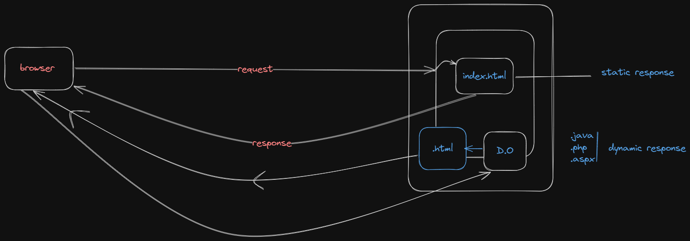
## Server:
* It is a computer which has the capability to provide output to any number of clients.
* Normally, a server computer woud be referred as high configuration computer.
* Inside the server computer we install a server software called web server.
* Eg : Tomcat, wildfly, glassfish.

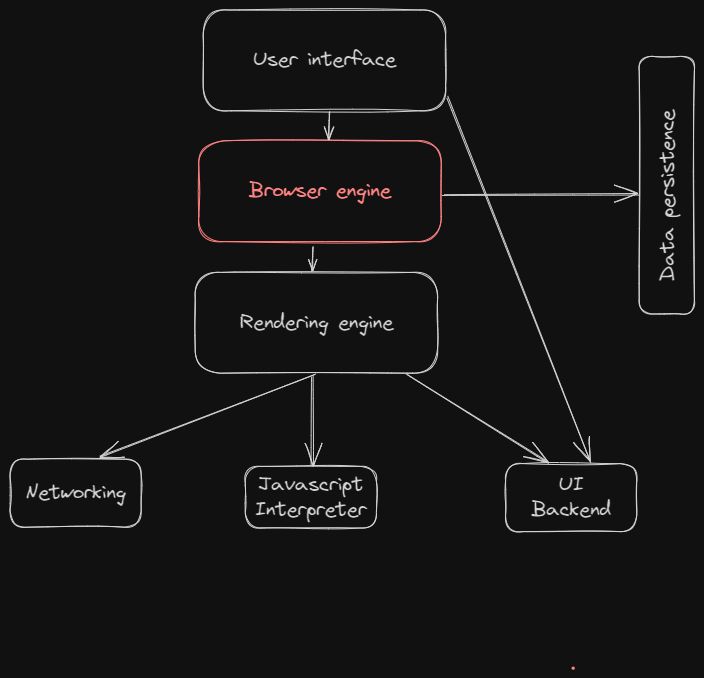
### Note:
* Installing nodejs wil promote a build tool through which we can automate the process of taking third party libraries from different websites to our projects with the help of a command called "npm".

# HTML:
* On a browser to display the content as per our requirement we need to __markup__ our content.
* To markup the content on the browser we need a language called __html__(hyper text markup language).

### HTML PARSING:
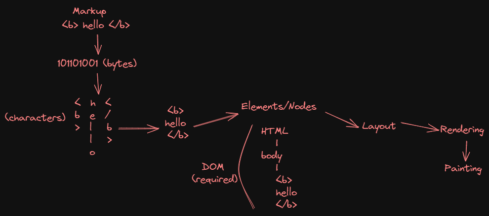

### Evolution of HTML language
* __GML__ : Generic makrup language.
* __SGML__ : Standard Generic makrup language.
* Tim Burner Lee introduced a new markup language called as HTML which is a subset of SGML.
* Initially, HTML language was a open source language.
* HTML was introduced as communicating language to web by Tim Burner Lee.
* HTML language is maintained by a community called __WHATWG__.
* HTML 4 version didn't gave importance for SEO and responsive design. 
* In HTML 5 different __semantics__ were introduced to give importance for SEO and response design.
* SEO refers to search engine optimization.
* Whenever we type some content on a browser which needs to be searched. Google search engine uses SEO technique(robo)
* BOT names : web spiders, web crawlers, bot etc...

### Categories of HTML element : 
1. Normal element Eg. bold tag
2. Void element Eg. img tag
3. RC(Rich context) data elements. 
Eg : 
```html
<textarea>
    <p> Hello pw'ian </p>
</textarea>
```
* Output :   <textarea>
        <p> Hello pw'ian </p>
    </textarea>
4. Raw text element
Eg :  1. Temperature 25C 4500/- 2. Temperature 25&deg;C &#8377;4500/-
5. Foreign element : importing someone's code. Eg : SVG, Mathl

### HTML Structure : 
* Aranging the elements of HTML in a hierarchial way to present on a webpage is called __"DOM"__.
```html
<html>
    <!--Document scope-->
    <head>

    </head>
    <body>
    
    </body>
</html>
```
* The content presented in the head section is mainly used for SEO and responsive design.
* The elements which can be written inside head section are :
```html
<title>
<link>
<meta>
<style>
<script>
```

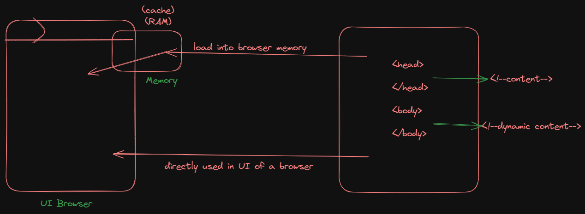

```html
<!DOCTYPE html>
```
* It is a indication to a browser engine that in the body section we use elements of HTML 5.
```html
<html lang = "en-IN">
```
* It is an indication to the browser that the output should be feasible to the end user in particular format. 
## Body section
### Attributes of body tag :
1. bgcolor : This attribute is used to set background color for body section.
2. text : This attribute is used to set a different color value for the content to be presented.
```html
<body bgcolor = "black" text = "white">
--
</body>
```
* To control elements on a webpage after the presentation we go for __CSS(styling language)__.
#### Note
* We can control images only through css attributes. 
* These attributes are defined in a ```<style>``` manner.
* CSS attributes for background are :
```css
background-repeat : repeat|no-repeat|repeat-x|repeat-y|
background-size : contain|cover|auto|width and height in pixels|
background-positon : top|center|right|left|
background-attachment : fixed|scroll|
```
### HTML 5 new semantics(elements) :
1. Header
2. Section
3. Nav
4. Main
5. Article
6. Figure
7. Figcaption
8. Dialog
9. Aside
10. Div
11. Span 
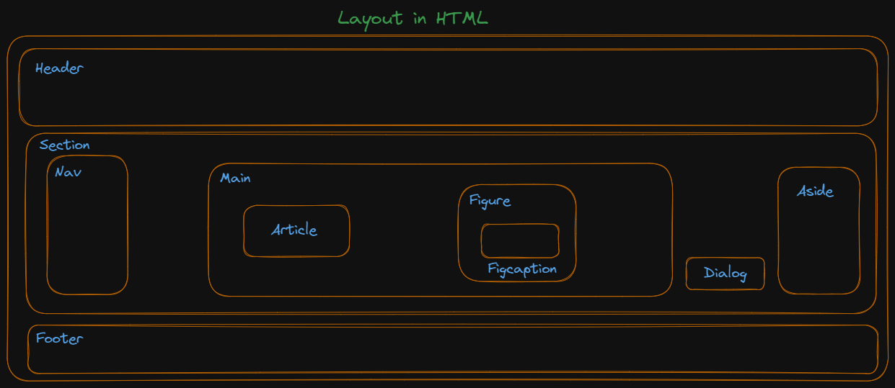

#### Note:
* The ```<span>``` tag is much like the ```<div>``` element, but ```<div>``` is a block level element and ```<span>``` is an inline element.
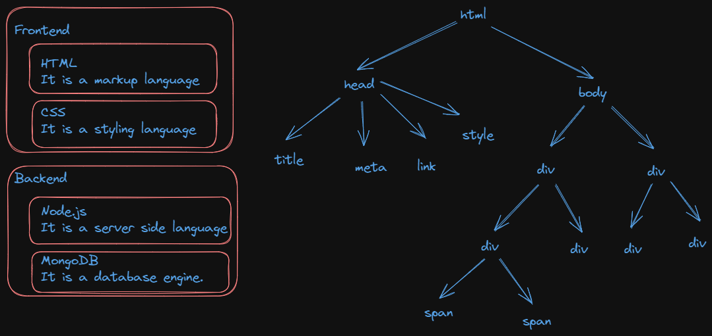

# DOM : 
* To align the content in column-wise using CSS. We have an option called __display:flex__.
* We can control the attribute of font through CSS using font-family,font-style,font-size,font-weight.
* For a span element, width property can't be applied directly. To see the effect we use a attribute called __display:inline-block__.
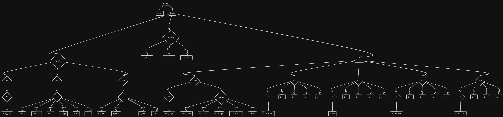

### Amazon:

[Amazon footer](http://127.0.0.1:3000/Footers/src/amazon_footer.html)
#### Amazon footer DOM:
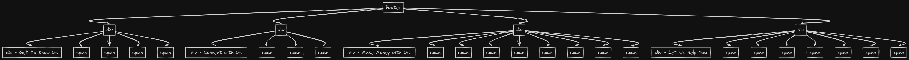

### Flipkart:
[Flipkart footer](http://127.0.0.1:3000/Footers/src/flipkart_footer.html)
#### Flipkart footer DOM:
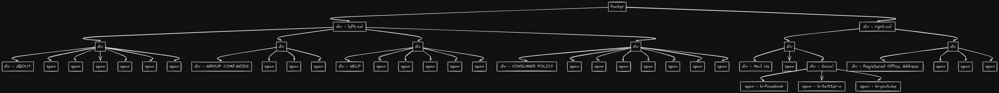

#### Note:
* Default screen width is 1200px, so max no of columns in a page is 12.

# Different types of CSS Selctor:
### Selecting child and sibling in CSS:
```
parent child{  --> child selector

}
Element A + Element B { --> Adjacent building

}
Element A ~ Element B { --> All elements are specifc

}
```
### Blurring an image :
* For any image to be blurred and if the content has to be presented on a blurred image we go for an attribute called background-color : rgba.
* "a" stands for alpha, the range of a is 0 to 1.More the value,lesser the blur.


### To display any content to the center:
1. Keep all the contents in one container.
2. 
```html
<body>
    <div>
        //your content here
    </div>
</body>
```
3. body is the container here which would display the contents center with attributes.
```css
body{
    dsiplay:flex;
    justify-content:center;
    align-items : center;
    height:100vh;
}
```
4. Note : 
    1. justify-content : center;(horizantal)
    2. align-items : center;(vertical)
 
# Fig and figcaption
* Fig caption element is used by search engine to load the image as a search result for the end user.
```html
<figcaption>
    <div>
        <!-- Place image -->
    </div>
</figcaption>
```   
#### Elements designed for coding platforms:
1. ```<code>``` : To indicate the presentation content is for programming.
2. ```<var>``` : To indicate the browser engine that it is a variable.
3. ```<samp>``` : To indicate the description about the program.
4. ```<pre>``` : It is used to preserve the white spaces in particular container.
5. ```&nbsp;``` : It is used to mark the spaces set by user at any element.
#### HTML basic entities and semantics for body
1. Line break ```<br>``` : 
    * Browser ignores the line breaks given in edition.
2. FAQ : What is the diffference between ```<br>``` and ```</br>```?
    * There is no such element called ```</br>```.
    * Always use ```<br>```. It is a self closing tag.

#### Small text and large text :
1. ```<small> small text</small>``` : It sets letter small size.
2. ```<large> large text</large>``` : It sets letter large size.

# Details and summary
```html
<body>
    <details>
        <summary></summary>
        <!-- content to be placed here-->
    </details>
</body>
```
* It is used to display the content in detail only when required.
* It allows to expand and collapse your content.
* It saves the screen space.

# Data list with terms and definitons :
#### Syntax :
```html
<dl>
    <dt>Term</dt>
    <dd>Definition</dd>
    <dt>Term</dt>
    <dd>Definition</dd>
</dl>
```
#### Note :
1. ```<dt>``` and ```<dd>``` will have some default alignment, so it is easy for presentation.
2. ```<dl>``` has the capability to display in columns using grid(dt --> one column and dd --> one column).

#### Note :
* We can make content [sticky](http://127.0.0.1:3000/HTML%20items/src/data-list/Sticky.html) on a webpage using CSS property.
```css
dt{
    position : sticky;
    top : 0;
}
```
### [box-shadow : ](http://127.0.0.1:5500/HTML%20items/src/data-list/box-shadow.html)
* In CSS we can set shadow to any container by using box-shadow box shadow will have 4 values.
```css
{
    box-shadow : horizontal vertical blur color;
}
```
* The unit of horizontal vertical blur is pixels.
# Heading elements :
* Heading elements are mainly used to define headings and to describe a <u>topic</u> in a webpage.
* Heading element default bheaviour is :
    1. display : block; 
    2. font-weight : bold;
    3. font-size : varies from heading to heading;
### Interview questions :

#### 1. Why to use heading element for heading?
#### 2. Why we have to use heading elements for giving heading, can't we configure using HTML text styles and CSS styles?
#### 3. __Can we change the appearance of ```<hn>``` tags?__
 * Through CSS we can change the default behaviour
```css
h1{
    font-size : 50px;
    font-weight : lighter;
    color : blue;
}
```
#### 4. Can we remove the default style defined for heading?
* Yes, it can be made possible with the help of CSS inheritance.
```css
h3{
    font-weight : unset;
    display : unset;
    font-size : unset;
}
```
## Working with paragraphs :
### ```<p>``` : 
1. To present the content in the form of paragraph, we use ```<p>``` element.
2. It supports "align" attribute, which can set text left, center, right or justified.
3. Paragraphs will have a line break before and after.
## Blockquotes :
1. It is used to present the summary of the content on a webpage. 
2. Blockquote is similar to paragraph but have left and right indentation for text.
3. It is defined by using ```<blockquote>``` element.
### Interview questions :
#### 1. How to set the first-line indent for paragraph or blockquote?
* Using CSS attribute called ```text-indent : ; ```
```css
blockquote{
    text-indent : 50px;
}
```
#### 2. How to set line space, word space, character space in a paragpraph?
* Using CSS attribute called ```line-height : ;```
```css
blockquote{
    line-height : 30px;
    word-spacing : 7px;
    letter-spacing : 3px;
}
```
#### 3. How to set a DropCap?
* By using the following style we can set DropCrap. : 
    * Access the first letter using the class: first-letter.
    * After Acessing the firstletter apply fonts [size, weight, family].
    * Apply css float as left.

## Difference between display : grid vs column of CSS attribute.
* display : grid would dsiplay the content column wise in the given frame width(column ratio).
* Columns : This attribute would take number of columns as input and display the content in <u>(continuous manner)</u>.

# Text formatting in HTML : 
### Font element :
* We can change the text formatting using font.
* font :: we can change the face(family), size, and color.
#### Syntax :
```css
<font face = " "  size = " " color = " " > Your text </font>
face : font family
size : 1 to 7 leve[increasing order]
color : It represents color name and color code.
```
| Design team | Review team |
| :-----------: | :-----------: |
|```<b>``` | ```<strong>``` |
|```<i>``` | ```<em>``` |
|```<u>``` | ```<ins>``` |
|```<strike>``` | ```<del>``` |

### Interview Questions :
#### 1. What are web safe fonts?
* These fonts are such fonts which would be available in every machine and it can't be deleted. 
* Eg : Sans-serif, monospace, serif.

# Ordered and unordered list
## Ordererd list : 
* Order list will add auto numbering for a list of options, which can update automatically when you add or delete items.
* Order list is defined by using ```<ol>``` element.
* Items in list are defined by using ```<li>```.

#### Syntax :
```html
<ol>
    <li> Item-1 </li>
    <li> Item-2 </li>
</ol>
```
#### Note :
* Default number will be given for items.

#### Type :
* It specifies the numbering type, which can be :
1. a
2. A
3. i
4. I
5. 1 (default)

#### start[number] :
* It defines the numbering level to start with.

### Nested list :
* Nesting of list elements.
#### Bad code :
```html
<ol>
    <li>Frontend</li>
    <ol type = "a">
        <li>HTML</li>
        <li>CSS</li>
    </ol>
    <li>Backend</li>
    <ol type = "a">
        <li>MongoDB</li>
        <li>NodeJS</li>
    </ol>
</ol>
```
#### Output : 
<ol>
    <li>Frontend</li>
    <ol type = "a">
        <li>HTML</li>
        <li>CSS</li>
    </ol>
    <li>Backend</li>
    <ol type = "a">
        <li>MongoDB</li>
        <li>NodeJS</li>
    </ol>
</ol>

#### Clean code :
```html
<ol>
    <li>Frontend
        <ol type = "a">
            <li>HTML</li>
            <li>CSS</li>
        </ol>
    </li>
    <li>Backend
        <ol type = "a">
            <li>MongoDB</li>
            <li>NodeJS</li>
    </li>
    </ol>
</ol>
```
#### Output :
<ol>
    <li>Frontend
        <ol type = "a">
            <li>HTML</li>
            <li>CSS</li>
        </ol>
    </li>
    <li>Backend
        <ol type = "a">
            <li>MongoDB</li>
            <li>NodeJS</li>
    </li>
    </ol>
</ol>

### Note : Don't use the bad code even if the output is same.

### Interview Questions :
#### Q1. How to remove numbering in order list?
* It is possible to remove numbering of ordered list element through a CSS attribute called ```list-style : "none"```
#### Q2. How to create a scrollable list?
1. Keep a border
2. Keep a proper width and height as per the content area.
3. using an CSS attribute called "overflow : hidden|scroll|auto"
#### Q3. How to display list items inline?
#### Q4. How to display ```<li>``` in column wise?
##### Grid : 
```css
ol{
display : grid;
grid-template-columns : 6fr 6fr;
}
```
* O/P :
* A.--------B.
* C.--------D.
* E.--------

## Unordered List
- It is used to define bulleted list.
- Bulleted list comprises of symbol instead of numbering.
- Unordered list is defined by using ```<ul>```
- List items are defined by using ```<li>```
- The attribute “type” defines the symbol type,which can be
	- disc
	- circle
	- square

```html
<body>
	<ul type="square">
		<li>Web Sever</li>
		<li>Web Site</li>
		<li>Web Page</li>
	</ul>
</body>
```
#### How to set Custom bullets?
* Ans. we can do by using list-style-image attribute of css.

#### To display the content in fixed style we can use the following attributes of css in "ul"

```css
ul{
    list-style: none;
    position: fixed;
    right: 20px;
    bottom: 10px;
    width: 5px;	
    background-color: white;
    padding: 5px;
}
```
# Pagenation: 
* It refers to process of displaying records by splitting them into <u>pages</u>.

```html
<ul>
    <li><span>&laquo;</span></li>
    <li><span>1</span></li>
    <li><span>2</span></li>
    <li class="disabled"><span>3</span></li>
    <li><span>4</span></li>
    <li><span>5</span></li>
    <li><span>...</span></li>
    <li><span>&raquo;</span></li>
</ul>
```
```css
body{
    display: flex;
    justify-content: center;
    align-items: end;
    height: 500px;
    }
ul{
    list-style: none;
    display: flex;
    }
li{
    margin-right: 10px;
    border : 1px solid black;
    width : 25px;
    padding: 5px;
    text-align: center;
    border-radius: 15px;
    background-color: lightcyan;
    }
```
# Images in HTML
* To use the images in your website you should keep license in mind. So, you need to check images -> tools -> usage rights -> creative common license.
```html
<body>
    <figure>
        
        <figcaption>Iphone</figcaption>
    </figure>
</body>
```
## Different types of images
| Abbreivation | File format | MIMEType | FileExtension |
| :-----------: | :-----------: | :-----------: | :-----------: | 
|APNG | Animated portable NetworkGraphics | image/apng | .apng |
|BMP | Bitmap file | image/bmp | .bmp |
|GIF | Graphics Interchange Format | image/gif | .gif |
|ICO | Microsoft icon | image/x-icon| .ico, .cur |
|JPEG | JointPhotographic Expert Group | image/jpeg | .jpg, .jpeg, .jfif, .pjeg, .pjp |
|PNG |PortableNetworkGraphics | image/png | .png |
| SVG   | ScalarVectorGraphics   | image/svg+xml | .svg          |
| TIFF  | TaggedImage FileFormat  | image/tiff    | .tiff,.tif    |
| WebP  | WebPicturFormat         | image/webp    | .webp         |


### What is MIME?
* MIME stands for <b>"Multipurpose internet mail extension".</b>
* Server upon sending the information to the browser, it will also send what type of information is being sent.
* To inform the type of information, we go for MIME type.

### Different types of images and their purpose
| Image type | Purpose|
| :-----------: | :-----------: | 
| PNG | 1. High resolution(More space) <br> 2.suitable for downloads |
| JPG | 1. Compressed image format(less space) <br> 2. good for presentation |
|GIF| 1. Low resolution <br> 2. Used for animations |
|SVG | 1. Not pixel based <br> 2. High zoom quality <br> <b>Eg :</b> Google maps, Bootstrap icons.
|Webp | If we try to save an image, it saves the entire image. Image alone can't be captured.| 

### Embedding an image in webpage :
```html

``` 
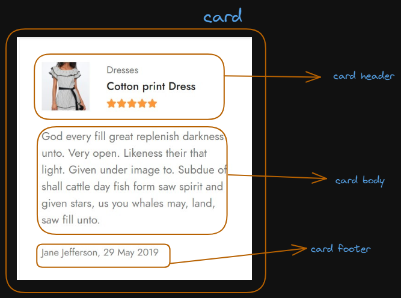

### What are fluid images?
* If we set the width and height of an image in percentage then the image will be adjusted to the browser window.
* If the image is adjusted to browser window through percentage then such images are termed as fluid images

# Links

* Links are basically used to navigate from one page to another page
* Links normally will be clickable text or an image which gets navigated through a protocol called "HTTP" 

### Syntax

```html
<body>
    <a href="">HOME</a><br>
    <a href="">KidsFashion</a><br>
    <a href="">MensFashion</a><br>
    <a href="">WomensFashion</a>
</body>
```

### We can create links in two ways
* Intra documents links
* Inter documents links

## Intra Documents Links

* It refers to one location to another location within the same page 

### Interview Questions

#### Q1. How to remove underline? 
* Ans: Using CSS attribute called text-decoration: none

#### Q2. How to change link color ?
```css
a:link{
	color: red;
}
```

#### Q3. In case the image attribute to specify the path , we use src . Where as in-case of anchor element to specify the path we use href why?
* *src* : It behaves like getter for image elements so we specify the path through src attribute.
* *href* : It behaves like setter for anchor element. So we specify the path through href attribute.

#### Q4. Difference between URL and URI?
* *URL*:
	* stands for uniform resource locator.
	* Ex: www.myntra.com
* *URI*: 
	* it stands for uniform resorce identifier.
	* Accessing particular element in a website thorugh some name.
	* Ex: www.mytra.com/watches

#### Q5. How to create a empty link in HTML? 
* If we use this ```<a href="#">``` then it is wrong.
* To create a empty link we use javascript code as shown below
```<a href="javascript:void()">HOME</a>```
* To give a link which actually navigate we use the following code
```<a href="javascript:void(location href="http//www.amazon.in")"></a>``` 

#### Note :
* Whenever we send a request, browser would create an object called "Http Request object"
* The Http Request object structure is shown below : <br>
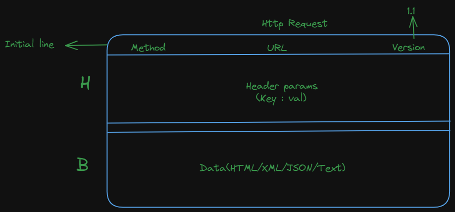
* Link request is of "GET" method type. <br>
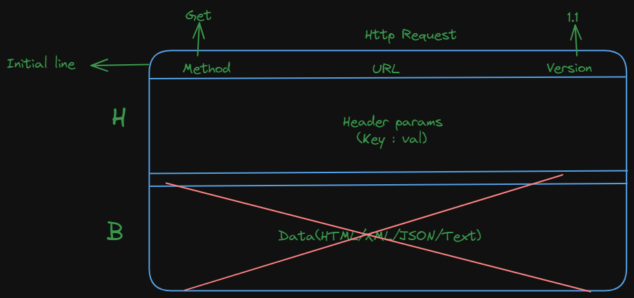
* If the request is of GET type, then there would be no request body (data will be sent through server through URL)
* Server will send a response by creating Http response object.<br>
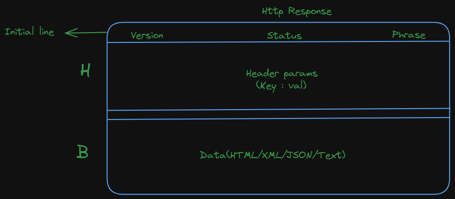


| **1xx Informational** | **2xx Success**              | **3xx Redirection**         | **4xx Client Error()**       | **5xx Server Error (Programmatical mistakes)**                   |
|-----------------------|------------------------------|-----------------------------|----------------------------|----------------------------------------|
| 100 Continue          | <u>200 OK   </u>                    | 301 Moved Permanently       | 400 Bad Request            | 500 Internal Server Error              |
| 101 Switching Protocols | <u>201 Created  </u>               | 302 Found                   | <u>401 Unauthorized </u>           | 501 Not Implemented                    |
| 102 Processing        | <u>202 Accepted    </u>             | 303 See Other               | 402 Payment Required        |<u> 502 Bad Gateway </u>                       |
| 103 Early Hints       | 203 Non-Authoritative        |                             |<u> 403 Forbidden   </u>            |<u> 503 Service Unavailable  </u>              |
|                       | <u>204 No Content  </u>             |                             |<u> 404 Not Found   </u>            | 504 Gateway Timeout                    |
|                       | 205 Reset Content            |                             |<u> 405 Method Not Allowed </u>     | 505 HTTP Version Not Supported         |
|                       | 206 Partial Content          |                             | 406 Not Acceptable          | 506 Variant Also Negotiates            |
|                       | 207 Multi-Status             |                             | 409 Conflict               | 507 Insufficient Storage               |
|                       | 208 Already Reported         |                             | 413 Payload Too Large       | 508 Loop Detected                      |
|                       |                              |                             | 429 Too Many Requests       | 510 Not Extended                       |
|                       |                              |                             |                            | 511 Network Authentication Required    |

#### Note :
* Normally, links will be corrupted by the end user through a techinque called "URL re-writing".

## Inter documentation links : 
### Interview questions :
#### Q1. How to display the content of a link in new tab?
 Using an attribute called ```target = _blank```(more values will be discussed in js).
#### Q2. How to specify upon clicking a link, a document to be downloaded?
```html
<li>
    <a href="public/docs/Springboot.pdf" download = "ioi_syllabus">Springboot</a>
</li>
```
* The file will be downloaded with the link name.
* To downlad a file with user defined file name, we use an option called ```download = "file_name_to_be_downloaded"```
#### Q3. Imp**. How to open a printer page in new window? 
```html
<li>
    <span class = "bi bi-printer-fill"></span>
    <a href = "javascript:window.print()">Printer</a>
</li>
```
#### Q4. How to open a linked document in new window? 
```html
<a href = "javascript:window.open('public/images/kids image.jpg,'title', width = 300, height = 300')">Kids image</a>
```
#### Q5. How to open a linked document in the same window along with other contents in a page? 
* Using an HTML 5 element called " **iframe** ".
```html
<iframe src = "" name = "">
```   

#### In order to embed any videos, ppt, documents we always take the help of iframe element in a page.
```html
<iframe src="https://www.youtube.com/embed/PmIuWS8jHys?si=T1I-G63BU-4eJc57"></iframe>
```
##### Note :
* Incase of intra document, if the page content is small and still if we want to give a navigation, we use an element called " **target** ".

# Table Elements in HTML

- **Tables** are used to organize data in rows and columns. However, data presented inside a table is not SEO-friendly.
- Tables are internally presented with the help of the "Grid" component.
- Data in a table is static, while filtering and sorting effects are achieved through backend technologies.
- In earlier versions of HTML, tables were used for designing layouts (rows and columns).
- In HTML5, tables are used only to present data statically using the elements shown below.

## Table Elements

| Element     | Description                                                                  |
|-------------|------------------------------------------------------------------------------|
| `<table>`   | It is a collection of rows and columns.                                      |
| `<caption>` | It sets a caption for the table, making it more SEO-friendly.                |
| `<thead>`   | It defines the table header section.                                         |
| `<tbody>`   | It defines the table body section.                                           |
| `<tfoot>`   | It defines the table footer section.                                         |
| `<th>`      | It defines the column heading content (header cell).                         |
| `<td>`      | It defines the table cell content (ordinary cell).                           |
| `<tr>`      | It defines a table row.                                                      |

---

## Attributes of Table

1. **Frame**  
   - Values: `void`, `above`, `below`, `lhs`, `rhs`.
   - This attribute is used to remove the outer border from the table.

2. **Border**  
   - This attribute is used to set the border for the entire table (for each cell and also it sets a frame for the entire table).
   - The value of the border can be `0` or `1`.
   - Increasing the value beyond `1` has no effect on the cells.

3. **Cellspacing and Cellpadding**  
   - These attributes are similar to margin and padding in CSS.

4. **Rules**  
   - Values: `col`, `rows`, `all`, `none`.
   - If both `rules` and `border` are used together, the `rules` value will dominate.
   - When using `rules`, avoid using `border`, and vice versa.

5. **Background color (bgcolor) and Image(background)**
    * bgcolor : It sets a background color for table, body, header, footer, cell, row.
    * background : It sets background image for table, group, row, cell.
    * **Syntax** :
        ```html
        <table background = "../" border = "1" width = "500">
        <table bgcolor = "red">
        <tr bgcolor = "red">
        <th bgcolor = "red">
        ```

6. **Height and width attribute**
    * Height : It defines height for row(affects whole row).
    * **Syntax** :
        ```html
        <tr height = "200"> <!-- best suited -->
        <th height = "200">
        <td height = "200">    
        ```
    * Width : It defines cell width(affects whole column).
    * **Syntax** :
        ```html
        <td width = "200">
        <th width = "200">  
        ```
7. **Align and v-align attributes**

    * In order to adjust the data within a cell, we use attributes called align(= left, right, center, justify) and v-align(= top, bottom, center).
    * These attributes are applicable only for particular cell.

8. **Merging or rows and columns**
    * colspan : It can merge specified number of columns into single column.
    * rowspan : It can merge specified number of rows into single row.
    * **Note** : colspan and rowspan can be applied only on `<td>|<th>`.

# Forms in HTML

- **Form** provides a UI where users can interact with our application.
- Interaction includes insert, update, delete, query, etc. (CRUD, CURD, SCUD).
- A form is a generic container that has default functionality.
- A form can submit and reset its data without configuring any explicit functionality.
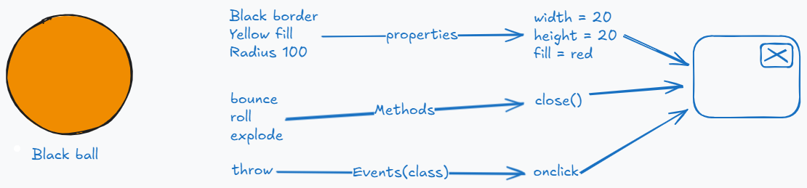
## Form container
* It is designed by using form tag.
### Syntax :
```html
<form>
    form element
</form>
```
### Note :
* In a page we can submit the details only when they are enclosed in a form.

#### Syntax :
```html
Name : <input type = "text" name = "Name"> // Not good
<form>
    Name : <input type = "text" name = "Name"> // Okay
</form>
```

## Form Attributes
* These 3 are required for identification purpose in javascript.
    1. id
    2. class
    3. name   
4. methods : It indicates how the data should be submitted to the server. The values of method are "**get or post**".
    1. Default method type is **get**(select query would run based on input).
    2. If we want to send large volume of data to the server then we go for **post method type**(insert query would for the input provided by the user).
    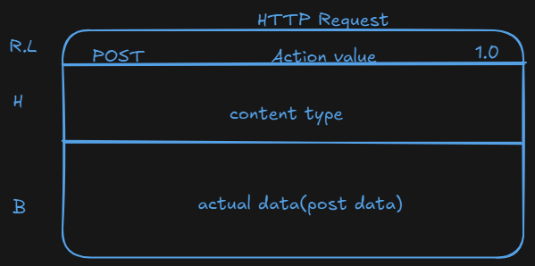
    

* The other values of method are PUT , PATCH , DELETE , TRACE , OPTION.
* To send the request of type PUT , PATCH ,DELETE . We use software's like curl , postman , open API.


### Differences between get and post
| GET|POST |
| :-----------: | :-----------: |
|It supports caching(saves round trip). | It doesn't supports caching.|
|Upon submitting the data, query string will be constructed and it will attach to **URL**.| Upon submitting the data, query string will not be constructed and it will not attach to **URL**.|
|Small volume of data would be allowed(2048 chars) |No limit on selecting the data(any volume) |
|You can't submit complex datas like audio,video files(binary data)(It supports only ASCII type)| You can submit in POST.|
|It's not safe. So, the data can be hacked|It's safe. So, the data can't be hacked easily.|

#### What is query string?
* It is a string which is constructed by web browser upon the user entering the details and clicking on submit button. Query string data would be in the form of key value pair.
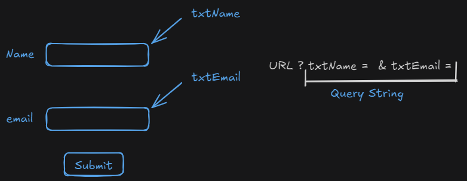

### Action : 
* This attribute value would be the location of program where the data has to be sent.

```html
<form method = "post" action = "http://localhost:9999/First-Project-01/first">
```
* method = "post" -> doPost(req,resp)
* method = "get" -> doGet(req,resp)

### novalidate :
* This attribute is used to verify wether the user entered data should be validated or not.
* If we use **novalidate** attribute then the input entered by the user should not be validated(email,number, etc...)

```html
<input> //HTML4
<textarea> //HTML4
<select> //HTML4
<progress> //HTML5
<meter> //HTML5
```

## Attributes of input element : 
    1. type = "text" : user can enter any character type of data.
    2. placeholder : It is normally used to key a watermark content of particular element.

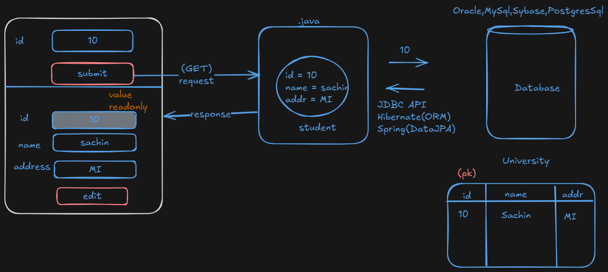

### Value :
* This attribute displays a value by default or shows the value by the programming language from the database.

### readonly :

### disabled : 


### Differences between readonly and disabled
* **readonly** would permit submitting the data to the backend wheras **disabled** would not permit submitting the data to the backend.

### required : 
* It indicates value should be compulsorily entered by the user otherwise the page should not be submitted.

### size = "5" :
* It adjusts the width of text box. Default width is 20.

### minlength = "4" :
* It indicates minimum number of characters to be entered by the user(validation).

### maxlength = "4" :
* It indicates maximum number of characters to be entered by the user(once it reaches the max limit user can't enter any data in the container).

### autofocus : 
* This attribute is used to focus on a particular element when the page gets loaded
* Through, javascript we can use this attribute to make it dynamic to identify the error elements in the webpage(validation failed elements).

### list :
* It uses a datalist that contains an option to display as auto completed text.
* datalist is designed using an element called `<datalist>`.
* To design a set of options to datalist we use an element called `<option>`.

# Pattern :
* With respect to this attribute we use a regular expression. Regular expression comprises of meta characters and quantifiers.

| Metacharacters     |  quantifiers                      |
|:-------------:|:--------------------------------------:|
| ? | {}|
| + | {m,n}|
| * | {m}|
| \| |    |
| . |    |
| [] |    |
| () |    |
| \ |    |
| ^ |    |
| \\^ |    |
| $ |    |


## Meta Characters

| Meta Character | Description                                                                 | Example Usage                                   |
|----------------|-----------------------------------------------------------------------------|-------------------------------------------------|
| `?`            | Defines zero or one occurrence of a character.                              | `<input pattern="colou?r" placeholder="color/colour" type="text" name="txtTest">` |
| `*`            | Defines zero or more occurrences of a character.                            | `<input pattern="colou*r" type="text" name="txtTest">` [e.g., color, colour, colouur, coloruuur] |
| `+`            | Defines one or more occurrences of a character.                             | `<input pattern="colou+r" type="text" name="txtTest">` [e.g., colour, colouur…] |
| `.` (dot)      | Matches any single character in the specified string. [e.g., A-Za-Z0-9!@#$%] | `<input pattern="b.y" type="text" name="txtTest">` [e.g., buy, boy] <br> `<input pattern=".y" type="text" name="txtTest">` [e.g., by, my] <br> Example: `pattern=".o."` [e.g., cow, toy, boy] <br> Example: `pattern=".at"` [e.g., cat, bat, mat, rat] |
| `\`            | Escape sequence character for special chars.                                | `pattern="gmail\.com"` [e.g., gmail.com] <br> `pattern="gmail.com"` [e.g., gmail2com, gmailzcom] |
| `\|` (pipe)     | Used as OR; matches any of the specified patterns.                          | `<input pattern="green\|red\|blue" type="text" name="txtTest">` |
| `^`            | Excludes specified characters.                                               | `pattern="[a,d,s]"` [e.g., a, d, s allowed] <br> `pattern="[^a,d,s]"` [e.g., all characters excluding a, d, s] |
| `[]`           | Range of characters.                                                          | `pattern="[a,d,s]"` [e.g., a, d, s are allowed] <br> `pattern="[a-z,A-Z]"` [e.g., a to z and A to Z are allowed] <br> `pattern="[0-9]"` [e.g., 0 to 9 are allowed] <br> `pattern="[a-zA-Z0-9]"` [e.g., Alphanumeric] <br> `pattern="[a-d,4-9]"` [e.g., a to d and 4 to 9 are allowed] <br> `pattern="[^A-Z]"` [e.g., excluding A-Z, all others are allowed] |
| `\^`           | Matches the beginning of input; "Starts with".                              | `pattern="^[a-z]"` [e.g., a starts with lowercase letter] |
| `$`            | Matches the end of input; "Ends with".                                      | `pattern="...your expression...$"` <br> Example: `pattern="^[a-z]\.[0-9]$"` [e.g., a.3] |
| `\d`           | Allows only numeric values, any single digit [0-9].                         | `<input pattern="\d\d" type="text" name="txtTest">` [e.g., any 2-digit number] <br> `<input pattern="\d?\d" type="text" name="txtTest">` [e.g., one or 2 digits] <br> `<input pattern="[0-9]" type="text" name="txtTest">` [e.g., one digit between 0-9] |
| `\D`           | Matches any character that is not a digit [^0-9] or \D only non-digit.     | `<input pattern="\D\D" type="text" name="txtTest">` [e.g., both should not be digits] <br> `<input pattern="\d\D" type="text" name="txtTest">` [e.g., first should be digit, second should not be digit] |
| `\s`           | Matches a single whitespace character including space, tab, form feed, etc. | `<input pattern="\d\s\d" type="text" name="txtTest">` <br> Examples: `\n` (line feed), `\f` (form feed), `\t` (horizontal tab), `\v` (vertical tab) |
| `\w`           | Matches alphanumeric characters and underscore. Equivalent to [A-Za-z0-9_] | `<input pattern="\w\w" type="text" name="txtTest">` |
| `\W`           | Matches any character that is not a word character [^A-Za-z0-9_]           | `<input pattern="\W" type="text" name="txtTest">` [e.g., %$#@&] |
| `\i`           | Ignore capitalization.                                                        | `<input pattern="colour\i" type="text" name="txtTest">` [e.g., color, Color, cOLOR] |


### Note : 
* Meta characters indicate what characters needs to be allowed wheras quantifiers how many times it has to be allowed.

## Quantifiers

| Quantifier | Description                          | Example Usage                                    |
|------------|--------------------------------------|--------------------------------------------------|
| `{n}`      | Exactly n occurrences of a character. | `pattern="\d{3}"` [e.g., Exactly 3 digits] <br> `pattern="\d{3}\D{2}"` [e.g., First 3 digits followed by 2 non-digits] |
| `{n,m}`    | Between n and m occurrences of a character. | `pattern="\w{4,15}"` [e.g., Alphanumeric min = 4 and max = 15] |
| `{n, }`    | At least n occurrences, with no upper limit. | `pattern="\w{4,}"` [e.g., Alphanumeric allowed min = 4, max can be any] |


### Regular Expression[PreDefined] :
1. (?=.*[A-Z]) : Atleast one uppercase letter at any place.
2. (?=.*[a-z]) : Atleast one lowercase letter at any place.
3. (?=.*[0-9]) : Atleast one numeric at any place.
4. (?=.*[!&@#$]) : Atleast one special character at any place.

### FAQs

1. **Write a pattern to validate a mobile number starting from +91 and should have 10 digits.**

   **Ans.** `^\+91\d{10}$`

2. **Write a pattern to validate a US mobile format number (e.g., +(1)(425) 555-0100).**

   **Ans.** `^\+\(1\)\(\d{3}\)\s\d{3}\-\d{4}$`

3. **Write a pattern for a UK mobile format number (e.g., +(44)(20)1234 5678).**

   **Ans.** `^\+\(44\)\(20\)\d{4}\s\d{4}$`

4. **Write a pattern to validate an IFSC code (e.g., SBIN0000813).**

   **Ans.** `^SBIN00\d{4}$`

5. **Write a pattern to allow only alphanumeric characters with 4 to 15 chars but special characters not allowed.**

   **Ans.** `^[A-Z0-9a-z]{4,15}$` <br> (Note: `\w{4,15}` allows underscores as well)

6. **Write a pattern to allow only alphabets with 4 to 15 chars but special characters not allowed.**

   **Ans.** `^[A-Z]{4,15}$`

7. **Write a pattern for a username starting with uppercase letters and can be 4 to 15 chars but special characters not allowed.**

   **Ans.** `^[A-Z][a-zA-Z]{3,14}$`

8. **Write a pattern to allow only alphanumeric characters with `_`, 4 to 15 chars but at least one or many characters can be uppercase.**

   **Ans.** `(?=.*[A-Z])\w{4,15}$`

9. **Write a pattern for a username 4 to 15 chars with at least one uppercase letter, number, and special character.**

   **Ans.** `(?=.*[A-Z])(?=.*[a-z])(?=.*[0-9])(?=.*[!@#%])\w{4,15}$`

# HTML Inputs
### type = "text" (defaut value of input type)
1) name,id,class
2) size
3) placeholder
4) autofocus 
5) value 
6) readonly
7) disabled 
8) requried : validation
9) minlength : validation
10) maxlenght : not able to enter if data exceeds max length
11) list : autosuggestion
12) pattern : validation using regex

### type = "password"
* Value entered by the user will be masked by star symbol.
* Enter the password :<br>
<input type="password" placeholder="Enter the password" name="textPassword">

### type = "number"
* To enter only the number type we use an attribute value "number".
* Age: ~minlength~  min <br>
<input type="number" name="txtNumber"   min="18" max="58" step="5">

### type="range"
* <input  type="range" min="1000" value="1000" max="100000" name="txtPrice">
* The value chosen by the slider option can be displayed on a page through "javascript"

### type="email"
* Synatx: <input type="email" name="txtEmail">
* It validates email address format.
* You can define "type=email".
* It just checks for "@", but will not worry about extension like (.com,.live,.ai,..)

### type="URL"
* It validate URL format.
* If you want the user to input website address [URL] and restrict to URL format the you can define type=url
* URL format should contains "protocol and domain" 
* Synatax: <input type="url" name="txtUrl" size="50">
* Example:
	* www.amazon.com => invalid
	* http://www.amazon.com => valid
	* https://www.amazon.com => valid

### type=color
* To give color type as an input we go for an option call type=color.
* Color input in HTML can provided in three ways
	1) name: "Red" "Blue" "Green"
	2) light colors : Darkcyan, Lightcyan, Lightgreen etc..
	3) Hexa decimal code:
		* Hexadecimal color can be defined in 3 or 6 chars followed by hash "#"
			* 3 Chars Code => #RGB
			* 3 Chars Code => #RRGGBB
		
		* Red, Green and Blue Value can be "0 to F"
			* Hexa: 0,1,2,3,4,5,6,7,8,9,a,b,c,d,e,f [0 is minimum , f in maxium]
			* 0 -> Dark , f -> Bright

### type=date/time
* HTML allows to input date value by using the "type=date"
* It is not supported on all browsers. hence we have to implement using jQuery.
* datetime value is removed from "html5 major version".
1. date
2. datetime - local
3. month 
4. week 
5. time

* **How to restrict the user for date selection?**

    **Ans.** Using min and max attributes.

#### Note:
* Always the date input must be "year-month-date" | "YYYT_MM_DD"(default formate of MySQL)

* <u>*Eg:*</u><br>
	*Departure:*<input type="date" name="txtDate" min="2024-09-02" max="2024-10-02"> <br>
	*DateTime:* <input type="datetime-local" name="txtDateTime"><br>
	*Week:* <input type="week" name="txtWeek"><br>
	*Month:* <input type="month" name="txtMonth"><br>
	*Time:* <input type="time" name="txtTime"><br>

### type="file"
* In order to accept file as the input from the user , we go for a type called file.
* It allows the client to browse and select any file from computer to upload into server.
* However it is just a control for selecting file, upload logic we have to write by using "JavaScript/JQuery" | "backend technology"
* You can define by using type="file"
* Syntax: <input type="file" name="txtFile" multiple accept=".png">

### Radio Buttons
* Radio Buttons are refered as group buttons (Mutex nature will be imposed on those elements by giving common names)
* *NOTE:*
	* Mutex refers to "Mutual Exclusion".
	* Mutual exculsion is a threading terminology where one thread should execute only one task at any given point of time.

* Synatx: Every one has same name
	html
	<input type="radio" name="age" value="1 to 18" checked><label>1 to 18</label>
    <input type="radio" name="age" value="19 to 59"><label>19 to 59</label>
    <input type="radio" name="age" value="above 60" disabled><label>60+</label>
	

1. **When should we use radio button element in a webpage?**
	* If we want a user to compulsory select one option among the supplied inputs, we go for radio buttons.
	* To remove it default selected ,we use an attribute called "checked".

2. **How to create a checkbox list in HTML?**

### Checkbox :
* Checkbox allows user to select and deselect any option.
* You can use checkbox for selecting one or multiple options from a group of choices.
* The attributes are same as radio buttons.
    * Id
    * Name
    * Class
    * Value
    * checked etc...
* It is defined by input using "type = checkbox".
#### Syntax :
<input type="checkbox" name="" value=""><label>Checkbox</label>

### Dropdown list:
* It allows the user to select any one option from a group of choices.
* It shows the list of items using a dropdown menu.
* HTML provides the following elements for desigining dropdown list:
    * `<select>` : It is used to configure a list.
    * `<option>` : It is used to configure a list item.
    * `<optgroup>` : It is used to group a set of options into one category.
* Every `<option>` comprises of following attributes :
    * value : It defines value to be submitted.
    * selected : It defines value to be selected.
    * disabled : To make it disabled we use this option.
#### Note : 
* In one line it is presenting more elements informataion.

### ListBox
* Everything is same as dropdown list in elements and attribute.
* It allows to select one or multiple.
* To change the dropdown into listbox you have use the attribute "size or multiple"

#### Note:
* The options in dropdown or listbox are RC data type. They allow only plain text number ans special chars.
* You can't add symbols or images in dropdown options.
* In order to add symbols or images wee need to use Bootstrap and CSS.
* We can't create nested drop downs using HTML (using bootstrap and CSS).

### Textarea : 
* It is used to handle mutli line input.
* It is similar to textbox but allows multiple lines.
* It is RC data element used to present plain text, it won't allow format for text.
* Attributes are similar to text input , additionally uses
	* rows :It represents height
	* cols : it represents width
	* readonly : It will not allow to modify text but we can submit.
	* disabled : It will not allow to modify and submit.

### METER ELEMENT:

* It is used to display the grade meter.
* It can display a value range with
	->min
	->max
	->value
	->low
	->high
* It can be controlled by javascript

Syntax:
	<meter min="" max="" value="" low="" high="" id="" class="" name="">

* low = >min
* high = <max
#### Note : 
* If low and difference is less(high - low = -ve) -> red color.
* If low and difference is high(high - low = +ve) -> yellow color.
* If low and difference is zero -> green color.

### PROGRESS ELEMENT:
* It is used to show the status of any task performed in the page.
* The task includes actions like : 
	* copying
    * Downloading
	* Uploading
	* Connecting etc.
* It is used to display the time elapsed or remaining to complete the task.
* Specially progress is used in  pages that use "Ajax" [Asynchronous JavaScript And XML]
* Attributes used for progress :
	* Min
	* Max
	* Value

**Generic Button**
* **HTML 5**
	* <button> TEXT|IMAGE|SYMBOL </button>
	* <button type="submit">TEXT|IMAGE|SYMBOL </button>
	* <button type="reset">TEXT|IMAGE|SYMBOL</button> 

* **HTML 4**
	* <input type="submit">TEXT</input>
	* <input type="reset">TEXT</input>

**Non-Generic Button**
* **HTML 5**
	* <button type="button" onclick="window.print()">Print Page</button>
* **HTML 4**
	* <input type="button">TEXT</input>

# Building forms using bootstrap classes :
## A. Container : 
* .container : smart watches
* .container-sm : mobiles
* .container-md : tablets
* .container-lg : pc
* .container-xl : laptop
* .container-xxl : laptop wide screen
* .container-fluid : responsive[fit according to design]

## B. Margins

- `(m)` margin in all directions  
- `ms-(size)` left margin (s=start)  
- `me-(size)` right margin (e=end)  
- `mt-(size)` top margin  
- `mb-(size)` bottom margin  

**Size**: 1 to 5

**Example**:  
```html
<form class="ms-4 mt-5">
```
## C. Padding

- `p-(size)` : padding in all directions  
- `ps-(size)` : left padding (s = start)  
- `pe-(size)` : right padding (e = end)  
- `pt-(size)` : top padding  
- `pb-(size)` : bottom padding  

**Size**: 1 to 5

## D. Border

- `border-(size)` : Border size (1 to 3)
- `border-(contextual)` : Contextual border  
   - Options: `warning`, `danger`, `success`, `info`, `primary`, `secondary`
- `rounded-(size)` : Rounded corners (1 to 5)
- `rounded-circle` : Full circle
- `rounded-pill` : Pill-shaped (requires sure width)

**Example**:
```html
<div class="border rounded-circle">
```

## E. Width and Height

- `w-(size)` : Width (25, 50, 75, 100)
- `h-(size)` : Height (25, 50, 75, 100)

## F. Display

- `.d-none` : Hides the element
- `.d-block` : Displays the element as a block-level element
- `.d-inline` : Displays the element as an inline element
- `.d-flex` : Displays the element as a flex container
- `.flex-wrap` : Allows flex items to wrap onto multiple lines
- `.flex-nowrap` : Prevents flex items from wrapping onto multiple lines

## G. Justify Content

- `justify-content-center` : Centers flex items horizontally
- `justify-content-between` : Distributes flex items evenly with space between them
- `justify-content-space-between` : Distributes flex items evenly with space between and around them

## H. Align Items

- `align-items-center` : Aligns flex items vertically in the center
- `align-items-end` : Aligns flex items to the end of the flex container
- `align-items-top` : Aligns flex items to the top of the flex container
- `align-items-start` : Aligns flex items to the start of the flex container
- `align-items-baseline` : Aligns flex items along the baseline of the flex container

## I. Grid 
- How to design a Grid(display : grid)?
    - row : 


