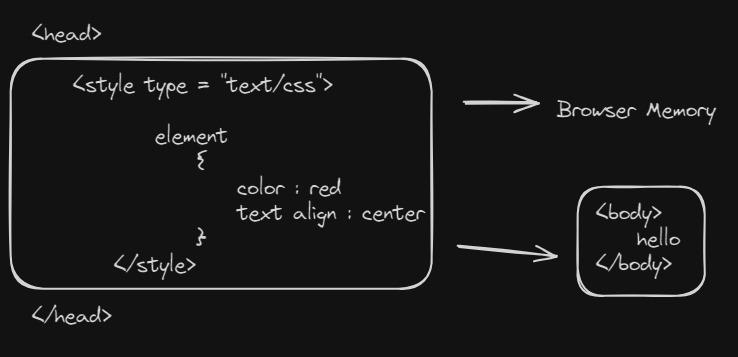
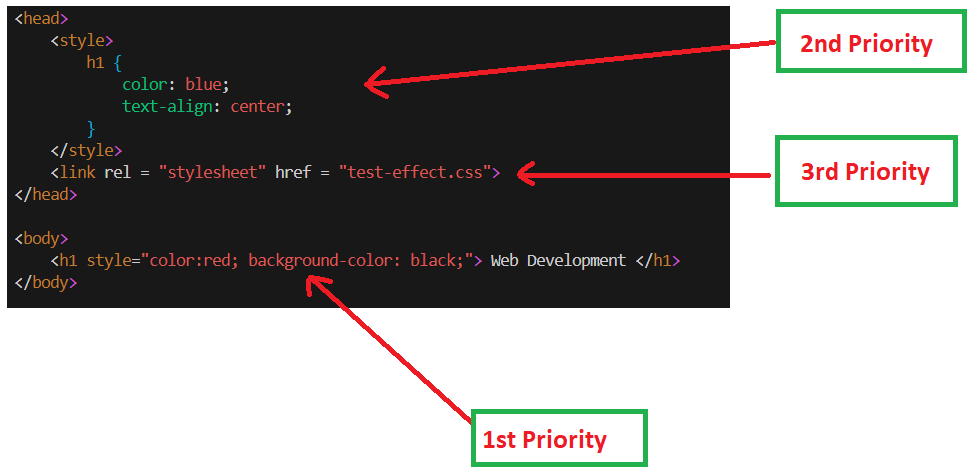
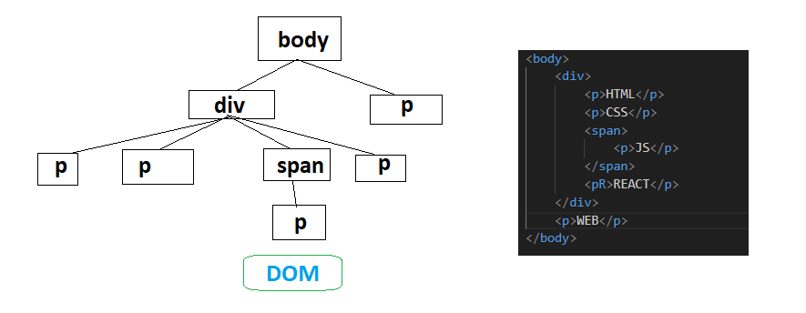
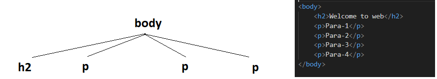
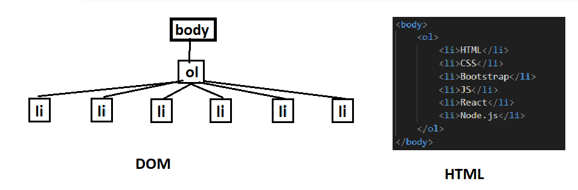
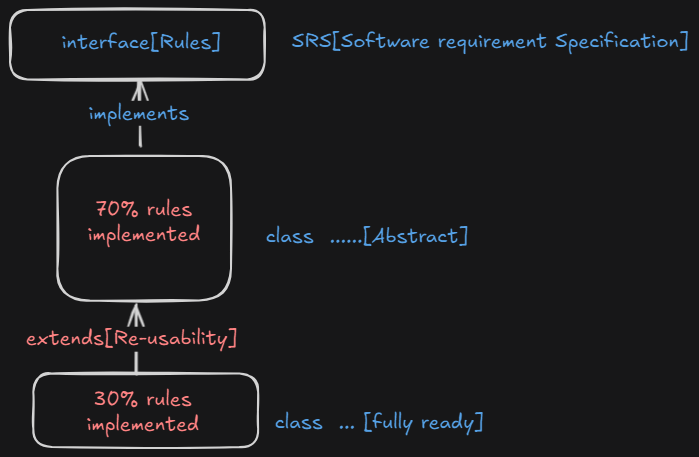
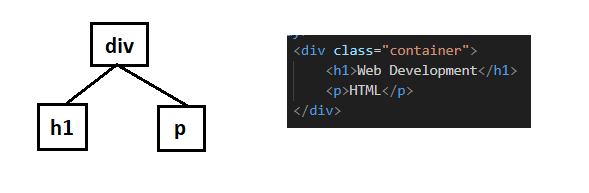
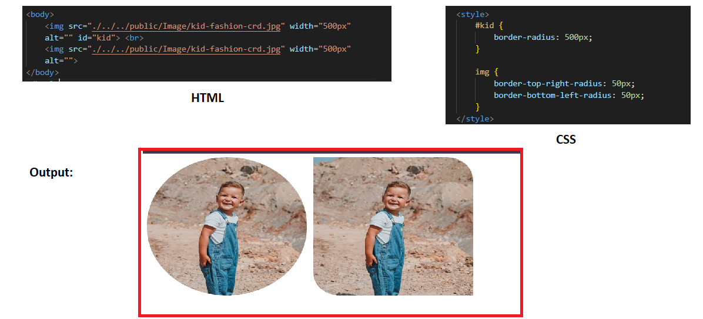

# Client server architecture:
* Client is a computer which is capable of sending request to other computers present in internet.
* We say client as a computer but in reality browser software is termed as a client.


## Server:
* It is a computer which has the capability to provide output to any number of clients.
* Normally, a server computer woud be referred as high configuration computer.
* Inside the server computer we install a server software called web server.
* Eg : Tomcat, wildfly, glassfish.


### Note:
* Installing nodejs wil promote a build tool through which we can automate the process of taking third party libraries from different websites to our projects with the help of a command called "npm".

# HTML:
* On a browser to display the content as per our requirement we need to __markup__ our content.
* To markup the content on the browser we need a language called __html__(hyper text markup language).

### HTML PARSING:


### Evolution of HTML language
* __GML__ : Generic makrup language.
* __SGML__ : Standard Generic makrup language.
* Tim Burner Lee introduced a new markup language called as HTML which is a subset of SGML.
* Initially, HTML language was a open source language.
* HTML was introduced as communicating language to web by Tim Burner Lee.
* HTML language is maintained by a community called __WHATWG__.
* HTML 4 version didn't gave importance for SEO and responsive design. 
* In HTML 5 different __semantics__ were introduced to give importance for SEO and response design.
* SEO refers to search engine optimization.
* Whenever we type some content on a browser which needs to be searched. Google search engine uses SEO technique(robo)
* BOT names : web spiders, web crawlers, bot etc...

### Categories of HTML element : 
1. Normal element Eg. bold tag
2. Void element Eg. img tag
3. RC(Rich context) data elements. 
Eg : 
```html
<textarea>
    <p> Hello pw'ian </p>
</textarea>
```
* Output :   <textarea>
        <p> Hello pw'ian </p>
    </textarea>
4. Raw text element
Eg :  1. Temperature 25C 4500/- 2. Temperature 25&deg;C &#8377;4500/-
5. Foreign element : importing someone's code. Eg : SVG, Mathl

### HTML Structure : 
* Aranging the elements of HTML in a hierarchial way to present on a webpage is called __"DOM"__.
```html
<html>
    <!--Document scope-->
    <head>

    </head>
    <body>
    
    </body>
</html>
```
* The content presented in the head section is mainly used for SEO and responsive design.
* The elements which can be written inside head section are :
```html
<title>
<link>
<meta>
<style>
<script>
```


```html
<!DOCTYPE html>
```
* It is a indication to a browser engine that in the body section we use elements of HTML 5.
```html
<html lang = "en-IN">
```
* It is an indication to the browser that the output should be feasible to the end user in particular format. 
## Body section
### Attributes of body tag :
1. bgcolor : This attribute is used to set background color for body section.
2. text : This attribute is used to set a different color value for the content to be presented.
```html
<body bgcolor = "black" text = "white">
--
</body>
```
* To control elements on a webpage after the presentation we go for __CSS(styling language)__.
#### Note
* We can control images only through css attributes. 
* These attributes are defined in a ```<style>``` manner.
* CSS attributes for background are :
```css
background-repeat : repeat|no-repeat|repeat-x|repeat-y|
background-size : contain|cover|auto|width and height in pixels|
background-positon : top|center|right|left|
background-attachment : fixed|scroll|
```
### HTML 5 new semantics(elements) :
1. Header
2. Section
3. Nav
4. Main
5. Article
6. Figure
7. Figcaption
8. Dialog
9. Aside
10. Div
11. Span 


#### Note:
* The ```<span>``` tag is much like the ```<div>``` element, but ```<div>``` is a block level element and ```<span>``` is an inline element.


# DOM : 
* To align the content in column-wise using CSS. We have an option called __display:flex__.
* We can control the attribute of font through CSS using font-family,font-style,font-size,font-weight.
* For a span element, width property can't be applied directly. To see the effect we use a attribute called __display:inline-block__.


### Amazon:

[Amazon footer](http://127.0.0.1:3000/Footers/src/amazon_footer.html)
#### Amazon footer DOM:


### Flipkart:
[Flipkart footer](http://127.0.0.1:3000/Footers/src/flipkart_footer.html)
#### Flipkart footer DOM:


#### Note:
* Default screen width is 1200px, so max no of columns in a page is 12.

# Different types of CSS Selctor:
### Selecting child and sibling in CSS:
```
parent child{  --> child selector

}
Element A + Element B { --> Adjacent building

}
Element A ~ Element B { --> All elements are specifc

}
```
### Blurring an image :
* For any image to be blurred and if the content has to be presented on a blurred image we go for an attribute called background-color : rgba.
* "a" stands for alpha, the range of a is 0 to 1.More the value,lesser the blur.


### To display any content to the center:
1. Keep all the contents in one container.
2. 
```html
<body>
    <div>
        //your content here
    </div>
</body>
```
3. body is the container here which would display the contents center with attributes.
```css
body{
    dsiplay:flex;
    justify-content:center;
    align-items : center;
    height:100vh;
}
```
4. Note : 
    1. justify-content : center;(horizantal)
    2. align-items : center;(vertical)
 
# Fig and figcaption
* Fig caption element is used by search engine to load the image as a search result for the end user.
```html
<figcaption>
    <div>
        <!-- Place image -->
    </div>
</figcaption>
```   
#### Elements designed for coding platforms:
1. ```<code>``` : To indicate the presentation content is for programming.
2. ```<var>``` : To indicate the browser engine that it is a variable.
3. ```<samp>``` : To indicate the description about the program.
4. ```<pre>``` : It is used to preserve the white spaces in particular container.
5. ```&nbsp;``` : It is used to mark the spaces set by user at any element.
#### HTML basic entities and semantics for body
1. Line break ```<br>``` : 
    * Browser ignores the line breaks given in edition.
2. FAQ : What is the diffference between ```<br>``` and ```</br>```?
    * There is no such element called ```</br>```.
    * Always use ```<br>```. It is a self closing tag.

#### Small text and large text :
1. ```<small> small text</small>``` : It sets letter small size.
2. ```<large> large text</large>``` : It sets letter large size.

# Details and summary
```html
<body>
    <details>
        <summary></summary>
        <!-- content to be placed here-->
    </details>
</body>
```
* It is used to display the content in detail only when required.
* It allows to expand and collapse your content.
* It saves the screen space.

# Data list with terms and definitons :
#### Syntax :
```html
<dl>
    <dt>Term</dt>
    <dd>Definition</dd>
    <dt>Term</dt>
    <dd>Definition</dd>
</dl>
```
#### Note :
1. ```<dt>``` and ```<dd>``` will have some default alignment, so it is easy for presentation.
2. ```<dl>``` has the capability to display in columns using grid(dt --> one column and dd --> one column).

#### Note :
* We can make content [sticky](http://127.0.0.1:3000/HTML%20items/src/data-list/Sticky.html) on a webpage using CSS property.
```css
dt{
    position : sticky;
    top : 0;
}
```
### [box-shadow : ](http://127.0.0.1:5500/HTML%20items/src/data-list/box-shadow.html)
* In CSS we can set shadow to any container by using box-shadow box shadow will have 4 values.
```css
{
    box-shadow : horizontal vertical blur color;
}
```
* The unit of horizontal vertical blur is pixels.
# Heading elements :
* Heading elements are mainly used to define headings and to describe a <u>topic</u> in a webpage.
* Heading element default bheaviour is :
    1. display : block; 
    2. font-weight : bold;
    3. font-size : varies from heading to heading;
### Interview questions :

#### 1. Why to use heading element for heading?
#### 2. Why we have to use heading elements for giving heading, can't we configure using HTML text styles and CSS styles?
#### 3. __Can we change the appearance of ```<hn>``` tags?__
 * Through CSS we can change the default behaviour
```css
h1{
    font-size : 50px;
    font-weight : lighter;
    color : blue;
}
```
#### 4. Can we remove the default style defined for heading?
* Yes, it can be made possible with the help of CSS inheritance.
```css
h3{
    font-weight : unset;
    display : unset;
    font-size : unset;
}
```
## Working with paragraphs :
### ```<p>``` : 
1. To present the content in the form of paragraph, we use ```<p>``` element.
2. It supports "align" attribute, which can set text left, center, right or justified.
3. Paragraphs will have a line break before and after.
## Blockquotes :
1. It is used to present the summary of the content on a webpage. 
2. Blockquote is similar to paragraph but have left and right indentation for text.
3. It is defined by using ```<blockquote>``` element.
### Interview questions :
#### 1. How to set the first-line indent for paragraph or blockquote?
* Using CSS attribute called ```text-indent : ; ```
```css
blockquote{
    text-indent : 50px;
}
```
#### 2. How to set line space, word space, character space in a paragpraph?
* Using CSS attribute called ```line-height : ;```
```css
blockquote{
    line-height : 30px;
    word-spacing : 7px;
    letter-spacing : 3px;
}
```
#### 3. How to set a DropCap?
* By using the following style we can set DropCrap. : 
    * Access the first letter using the class: first-letter.
    * After Acessing the firstletter apply fonts [size, weight, family].
    * Apply css float as left.

## Difference between display : grid vs column of CSS attribute.
* display : grid would dsiplay the content column wise in the given frame width(column ratio).
* Columns : This attribute would take number of columns as input and display the content in <u>(continuous manner)</u>.

# Text formatting in HTML : 
### Font element :
* We can change the text formatting using font.
* font :: we can change the face(family), size, and color.
#### Syntax :
```css
<font face = " "  size = " " color = " " > Your text </font>
face : font family
size : 1 to 7 leve[increasing order]
color : It represents color name and color code.
```
| Design team | Review team |
| :-----------: | :-----------: |
|```<b>``` | ```<strong>``` |
|```<i>``` | ```<em>``` |
|```<u>``` | ```<ins>``` |
|```<strike>``` | ```<del>``` |

### Interview Questions :
#### 1. What are web safe fonts?
* These fonts are such fonts which would be available in every machine and it can't be deleted. 
* Eg : Sans-serif, monospace, serif.

# Ordered and unordered list
## Ordererd list : 
* Order list will add auto numbering for a list of options, which can update automatically when you add or delete items.
* Order list is defined by using ```<ol>``` element.
* Items in list are defined by using ```<li>```.

#### Syntax :
```html
<ol>
    <li> Item-1 </li>
    <li> Item-2 </li>
</ol>
```
#### Note :
* Default number will be given for items.

#### Type :
* It specifies the numbering type, which can be :
1. a
2. A
3. i
4. I
5. 1 (default)

#### start[number] :
* It defines the numbering level to start with.

### Nested list :
* Nesting of list elements.
#### Bad code :
```html
<ol>
    <li>Frontend</li>
    <ol type = "a">
        <li>HTML</li>
        <li>CSS</li>
    </ol>
    <li>Backend</li>
    <ol type = "a">
        <li>MongoDB</li>
        <li>NodeJS</li>
    </ol>
</ol>
```
#### Output : 
<ol>
    <li>Frontend</li>
    <ol type = "a">
        <li>HTML</li>
        <li>CSS</li>
    </ol>
    <li>Backend</li>
    <ol type = "a">
        <li>MongoDB</li>
        <li>NodeJS</li>
    </ol>
</ol>

#### Clean code :
```html
<ol>
    <li>Frontend
        <ol type = "a">
            <li>HTML</li>
            <li>CSS</li>
        </ol>
    </li>
    <li>Backend
        <ol type = "a">
            <li>MongoDB</li>
            <li>NodeJS</li>
    </li>
    </ol>
</ol>
```
#### Output :
<ol>
    <li>Frontend
        <ol type = "a">
            <li>HTML</li>
            <li>CSS</li>
        </ol>
    </li>
    <li>Backend
        <ol type = "a">
            <li>MongoDB</li>
            <li>NodeJS</li>
    </li>
    </ol>
</ol>

### Note : Don't use the bad code even if the output is same.

### Interview Questions :
#### Q1. How to remove numbering in order list?
* It is possible to remove numbering of ordered list element through a CSS attribute called ```list-style : "none"```
#### Q2. How to create a scrollable list?
1. Keep a border
2. Keep a proper width and height as per the content area.
3. using an CSS attribute called "overflow : hidden|scroll|auto"
#### Q3. How to display list items inline?
#### Q4. How to display ```<li>``` in column wise?
##### Grid : 
```css
ol{
display : grid;
grid-template-columns : 6fr 6fr;
}
```
* O/P :
* A.--------B.
* C.--------D.
* E.--------

## Unordered List
- It is used to define bulleted list.
- Bulleted list comprises of symbol instead of numbering.
- Unordered list is defined by using ```<ul>```
- List items are defined by using ```<li>```
- The attribute “type” defines the symbol type,which can be
	- disc
	- circle
	- square

```html
<body>
	<ul type="square">
		<li>Web Sever</li>
		<li>Web Site</li>
		<li>Web Page</li>
	</ul>
</body>
```
#### How to set Custom bullets?
* Ans. we can do by using list-style-image attribute of css.

#### To display the content in fixed style we can use the following attributes of css in "ul"

```css
ul{
    list-style: none;
    position: fixed;
    right: 20px;
    bottom: 10px;
    width: 5px;	
    background-color: white;
    padding: 5px;
}
```
# Pagenation: 
* It refers to process of displaying records by splitting them into <u>pages</u>.

```html
<ul>
    <li><span>&laquo;</span></li>
    <li><span>1</span></li>
    <li><span>2</span></li>
    <li class="disabled"><span>3</span></li>
    <li><span>4</span></li>
    <li><span>5</span></li>
    <li><span>...</span></li>
    <li><span>&raquo;</span></li>
</ul>
```
```css
body{
    display: flex;
    justify-content: center;
    align-items: end;
    height: 500px;
    }
ul{
    list-style: none;
    display: flex;
    }
li{
    margin-right: 10px;
    border : 1px solid black;
    width : 25px;
    padding: 5px;
    text-align: center;
    border-radius: 15px;
    background-color: lightcyan;
    }
```
# Images in HTML
* To use the images in your website you should keep license in mind. So, you need to check images -> tools -> usage rights -> creative common license.
```html
<body>
    <figure>
        
        <figcaption>Iphone</figcaption>
    </figure>
</body>
```
## Different types of images
| Abbreivation | File format | MIMEType | FileExtension |
| :-----------: | :-----------: | :-----------: | :-----------: | 
|APNG | Animated portable NetworkGraphics | image/apng | .apng |
|BMP | Bitmap file | image/bmp | .bmp |
|GIF | Graphics Interchange Format | image/gif | .gif |
|ICO | Microsoft icon | image/x-icon| .ico, .cur |
|JPEG | JointPhotographic Expert Group | image/jpeg | .jpg, .jpeg, .jfif, .pjeg, .pjp |
|PNG |PortableNetworkGraphics | image/png | .png |
| SVG   | ScalarVectorGraphics   | image/svg+xml | .svg          |
| TIFF  | TaggedImage FileFormat  | image/tiff    | .tiff,.tif    |
| WebP  | WebPicturFormat         | image/webp    | .webp         |


### What is MIME?
* MIME stands for <b>"Multipurpose internet mail extension".</b>
* Server upon sending the information to the browser, it will also send what type of information is being sent.
* To inform the type of information, we go for MIME type.

### Different types of images and their purpose
| Image type | Purpose|
| :-----------: | :-----------: | 
| PNG | 1. High resolution(More space) <br> 2.suitable for downloads |
| JPG | 1. Compressed image format(less space) <br> 2. good for presentation |
|GIF| 1. Low resolution <br> 2. Used for animations |
|SVG | 1. Not pixel based <br> 2. High zoom quality <br> <b>Eg :</b> Google maps, Bootstrap icons.
|Webp | If we try to save an image, it saves the entire image. Image alone can't be captured.| 

### Embedding an image in webpage :
```html

``` 


### What are fluid images?
* If we set the width and height of an image in percentage then the image will be adjusted to the browser window.
* If the image is adjusted to browser window through percentage then such images are termed as fluid images

# Links

* Links are basically used to navigate from one page to another page
* Links normally will be clickable text or an image which gets navigated through a protocol called "HTTP" 

### Syntax

```html
<body>
    <a href="">HOME</a><br>
    <a href="">KidsFashion</a><br>
    <a href="">MensFashion</a><br>
    <a href="">WomensFashion</a>
</body>
```

### We can create links in two ways
* Intra documents links
* Inter documents links

## Intra Documents Links

* It refers to one location to another location within the same page 

### Interview Questions

#### Q1. How to remove underline? 
* Ans: Using CSS attribute called text-decoration: none

#### Q2. How to change link color ?
```css
a:link{
	color: red;
}
```

#### Q3. In case the image attribute to specify the path , we use src . Where as in-case of anchor element to specify the path we use href why?
* *src* : It behaves like getter for image elements so we specify the path through src attribute.
* *href* : It behaves like setter for anchor element. So we specify the path through href attribute.

#### Q4. Difference between URL and URI?
* *URL*:
	* stands for uniform resource locator.
	* Ex: www.myntra.com
* *URI*: 
	* it stands for uniform resorce identifier.
	* Accessing particular element in a website thorugh some name.
	* Ex: www.mytra.com/watches

#### Q5. How to create a empty link in HTML? 
* If we use this ```<a href="#">``` then it is wrong.
* To create a empty link we use javascript code as shown below
```<a href="javascript:void()">HOME</a>```
* To give a link which actually navigate we use the following code
```<a href="javascript:void(location href="http//www.amazon.in")"></a>``` 

#### Note :
* Whenever we send a request, browser would create an object called "Http Request object"
* The Http Request object structure is shown below : <br>

* Link request is of "GET" method type. <br>

* If the request is of GET type, then there would be no request body (data will be sent through server through URL)
* Server will send a response by creating Http response object.<br>


| **1xx Informational** | **2xx Success**              | **3xx Redirection**         | **4xx Client Error()**       | **5xx Server Error (Programmatical mistakes)**                   |
|-----------------------|------------------------------|-----------------------------|----------------------------|----------------------------------------|
| 100 Continue          | <u>200 OK   </u>                    | 301 Moved Permanently       | 400 Bad Request            | 500 Internal Server Error              |
| 101 Switching Protocols | <u>201 Created  </u>               | 302 Found                   | <u>401 Unauthorized </u>           | 501 Not Implemented                    |
| 102 Processing        | <u>202 Accepted    </u>             | 303 See Other               | 402 Payment Required        |<u> 502 Bad Gateway </u>                       |
| 103 Early Hints       | 203 Non-Authoritative        |                             |<u> 403 Forbidden   </u>            |<u> 503 Service Unavailable  </u>              |
|                       | <u>204 No Content  </u>             |                             |<u> 404 Not Found   </u>            | 504 Gateway Timeout                    |
|                       | 205 Reset Content            |                             |<u> 405 Method Not Allowed </u>     | 505 HTTP Version Not Supported         |
|                       | 206 Partial Content          |                             | 406 Not Acceptable          | 506 Variant Also Negotiates            |
|                       | 207 Multi-Status             |                             | 409 Conflict               | 507 Insufficient Storage               |
|                       | 208 Already Reported         |                             | 413 Payload Too Large       | 508 Loop Detected                      |
|                       |                              |                             | 429 Too Many Requests       | 510 Not Extended                       |
|                       |                              |                             |                            | 511 Network Authentication Required    |

#### Note :
* Normally, links will be corrupted by the end user through a techinque called "URL re-writing".

## Inter documentation links : 
### Interview questions :
#### Q1. How to display the content of a link in new tab?
 Using an attribute called ```target = _blank```(more values will be discussed in js).
#### Q2. How to specify upon clicking a link, a document to be downloaded?
```html
<li>
    <a href="public/docs/Springboot.pdf" download = "ioi_syllabus">Springboot</a>
</li>
```
* The file will be downloaded with the link name.
* To downlad a file with user defined file name, we use an option called ```download = "file_name_to_be_downloaded"```
#### Q3. Imp**. How to open a printer page in new window? 
```html
<li>
    <span class = "bi bi-printer-fill"></span>
    <a href = "javascript:window.print()">Printer</a>
</li>
```
#### Q4. How to open a linked document in new window? 
```html
<a href = "javascript:window.open('public/images/kids image.jpg,'title', width = 300, height = 300')">Kids image</a>
```
#### Q5. How to open a linked document in the same window along with other contents in a page? 
* Using an HTML 5 element called " **iframe** ".
```html
<iframe src = "" name = "">
```   

#### In order to embed any videos, ppt, documents we always take the help of iframe element in a page.
```html
<iframe src="https://www.youtube.com/embed/PmIuWS8jHys?si=T1I-G63BU-4eJc57"></iframe>
```
##### Note :
* Incase of intra document, if the page content is small and still if we want to give a navigation, we use an element called " **target** ".

# Table Elements in HTML

- **Tables** are used to organize data in rows and columns. However, data presented inside a table is not SEO-friendly.
- Tables are internally presented with the help of the "Grid" component.
- Data in a table is static, while filtering and sorting effects are achieved through backend technologies.
- In earlier versions of HTML, tables were used for designing layouts (rows and columns).
- In HTML5, tables are used only to present data statically using the elements shown below.

## Table Elements

| Element     | Description                                                                  |
|-------------|------------------------------------------------------------------------------|
| `<table>`   | It is a collection of rows and columns.                                      |
| `<caption>` | It sets a caption for the table, making it more SEO-friendly.                |
| `<thead>`   | It defines the table header section.                                         |
| `<tbody>`   | It defines the table body section.                                           |
| `<tfoot>`   | It defines the table footer section.                                         |
| `<th>`      | It defines the column heading content (header cell).                         |
| `<td>`      | It defines the table cell content (ordinary cell).                           |
| `<tr>`      | It defines a table row.                                                      |

---

## Attributes of Table

1. **Frame**  
   - Values: `void`, `above`, `below`, `lhs`, `rhs`.
   - This attribute is used to remove the outer border from the table.

2. **Border**  
   - This attribute is used to set the border for the entire table (for each cell and also it sets a frame for the entire table).
   - The value of the border can be `0` or `1`.
   - Increasing the value beyond `1` has no effect on the cells.

3. **Cellspacing and Cellpadding**  
   - These attributes are similar to margin and padding in CSS.

4. **Rules**  
   - Values: `col`, `rows`, `all`, `none`.
   - If both `rules` and `border` are used together, the `rules` value will dominate.
   - When using `rules`, avoid using `border`, and vice versa.

5. **Background color (bgcolor) and Image(background)**
    * bgcolor : It sets a background color for table, body, header, footer, cell, row.
    * background : It sets background image for table, group, row, cell.
    * **Syntax** :
        ```html
        <table background = "../" border = "1" width = "500">
        <table bgcolor = "red">
        <tr bgcolor = "red">
        <th bgcolor = "red">
        ```

6. **Height and width attribute**
    * Height : It defines height for row(affects whole row).
    * **Syntax** :
        ```html
        <tr height = "200"> <!-- best suited -->
        <th height = "200">
        <td height = "200">    
        ```
    * Width : It defines cell width(affects whole column).
    * **Syntax** :
        ```html
        <td width = "200">
        <th width = "200">  
        ```
7. **Align and v-align attributes**

    * In order to adjust the data within a cell, we use attributes called align(= left, right, center, justify) and v-align(= top, bottom, center).
    * These attributes are applicable only for particular cell.

8. **Merging or rows and columns**
    * colspan : It can merge specified number of columns into single column.
    * rowspan : It can merge specified number of rows into single row.
    * **Note** : colspan and rowspan can be applied only on `<td>|<th>`.

# Forms in HTML

- **Form** provides a UI where users can interact with our application.
- Interaction includes insert, update, delete, query, etc. (CRUD, CURD, SCUD).
- A form is a generic container that has default functionality.
- A form can submit and reset its data without configuring any explicit functionality.

## Form container
* It is designed by using form tag.
### Syntax :
```html
<form>
    form element
</form>
```
### Note :
* In a page we can submit the details only when they are enclosed in a form.

#### Syntax :
```html
Name : <input type = "text" name = "Name"> // Not good
<form>
    Name : <input type = "text" name = "Name"> // Okay
</form>
```

## Form Attributes
* These 3 are required for identification purpose in javascript.
    1. id
    2. class
    3. name   
4. methods : It indicates how the data should be submitted to the server. The values of method are "**get or post**".
    1. Default method type is **get**(select query would run based on input).
    2. If we want to send large volume of data to the server then we go for **post method type**(insert query would for the input provided by the user).
    
    

* The other values of method are PUT , PATCH , DELETE , TRACE , OPTION.
* To send the request of type PUT , PATCH ,DELETE . We use software's like curl , postman , open API.


### Differences between get and post
| GET|POST |
| :-----------: | :-----------: |
|It supports caching(saves round trip). | It doesn't supports caching.|
|Upon submitting the data, query string will be constructed and it will attach to **URL**.| Upon submitting the data, query string will not be constructed and it will not attach to **URL**.|
|Small volume of data would be allowed(2048 chars) |No limit on selecting the data(any volume) |
|You can't submit complex datas like audio,video files(binary data)(It supports only ASCII type)| You can submit in POST.|
|It's not safe. So, the data can be hacked|It's safe. So, the data can't be hacked easily.|

#### What is query string?
* It is a string which is constructed by web browser upon the user entering the details and clicking on submit button. Query string data would be in the form of key value pair.


### Action : 
* This attribute value would be the location of program where the data has to be sent.

```html
<form method = "post" action = "http://localhost:9999/First-Project-01/first">
```
* method = "post" -> doPost(req,resp)
* method = "get" -> doGet(req,resp)

### novalidate :
* This attribute is used to verify wether the user entered data should be validated or not.
* If we use **novalidate** attribute then the input entered by the user should not be validated(email,number, etc...)

```html
<input> //HTML4
<textarea> //HTML4
<select> //HTML4
<progress> //HTML5
<meter> //HTML5
```

## Attributes of input element : 
    1. type = "text" : user can enter any character type of data.
    2. placeholder : It is normally used to key a watermark content of particular element.


### Value :
* This attribute displays a value by default or shows the value by the programming language from the database.

### readonly :

### disabled : 


### Differences between readonly and disabled
* **readonly** would permit submitting the data to the backend wheras **disabled** would not permit submitting the data to the backend.

### required : 
* It indicates value should be compulsorily entered by the user otherwise the page should not be submitted.

### size = "5" :
* It adjusts the width of text box. Default width is 20.

### minlength = "4" :
* It indicates minimum number of characters to be entered by the user(validation).

### maxlength = "4" :
* It indicates maximum number of characters to be entered by the user(once it reaches the max limit user can't enter any data in the container).

### autofocus : 
* This attribute is used to focus on a particular element when the page gets loaded
* Through, javascript we can use this attribute to make it dynamic to identify the error elements in the webpage(validation failed elements).

### list :
* It uses a datalist that contains an option to display as auto completed text.
* datalist is designed using an element called `<datalist>`.
* To design a set of options to datalist we use an element called `<option>`.

# Pattern :
* With respect to this attribute we use a regular expression. Regular expression comprises of meta characters and quantifiers.

| Metacharacters     |  quantifiers                      |
|:-------------:|:--------------------------------------:|
| ? | {}|
| + | {m,n}|
| * | {m}|
| \| |    |
| . |    |
| [] |    |
| () |    |
| \ |    |
| ^ |    |
| \\^ |    |
| $ |    |


## Meta Characters

| Meta Character | Description                                                                 | Example Usage                                   |
|----------------|-----------------------------------------------------------------------------|-------------------------------------------------|
| `?`            | Defines zero or one occurrence of a character.                              | `<input pattern="colou?r" placeholder="color/colour" type="text" name="txtTest">` |
| `*`            | Defines zero or more occurrences of a character.                            | `<input pattern="colou*r" type="text" name="txtTest">` [e.g., color, colour, colouur, coloruuur] |
| `+`            | Defines one or more occurrences of a character.                             | `<input pattern="colou+r" type="text" name="txtTest">` [e.g., colour, colouur…] |
| `.` (dot)      | Matches any single character in the specified string. [e.g., A-Za-Z0-9!@#$%] | `<input pattern="b.y" type="text" name="txtTest">` [e.g., buy, boy] <br> `<input pattern=".y" type="text" name="txtTest">` [e.g., by, my] <br> Example: `pattern=".o."` [e.g., cow, toy, boy] <br> Example: `pattern=".at"` [e.g., cat, bat, mat, rat] |
| `\`            | Escape sequence character for special chars.                                | `pattern="gmail\.com"` [e.g., gmail.com] <br> `pattern="gmail.com"` [e.g., gmail2com, gmailzcom] |
| `\|` (pipe)     | Used as OR; matches any of the specified patterns.                          | `<input pattern="green\|red\|blue" type="text" name="txtTest">` |
| `^`            | Excludes specified characters.                                               | `pattern="[a,d,s]"` [e.g., a, d, s allowed] <br> `pattern="[^a,d,s]"` [e.g., all characters excluding a, d, s] |
| `[]`           | Range of characters.                                                          | `pattern="[a,d,s]"` [e.g., a, d, s are allowed] <br> `pattern="[a-z,A-Z]"` [e.g., a to z and A to Z are allowed] <br> `pattern="[0-9]"` [e.g., 0 to 9 are allowed] <br> `pattern="[a-zA-Z0-9]"` [e.g., Alphanumeric] <br> `pattern="[a-d,4-9]"` [e.g., a to d and 4 to 9 are allowed] <br> `pattern="[^A-Z]"` [e.g., excluding A-Z, all others are allowed] |
| `\^`           | Matches the beginning of input; "Starts with".                              | `pattern="^[a-z]"` [e.g., a starts with lowercase letter] |
| `$`            | Matches the end of input; "Ends with".                                      | `pattern="...your expression...$"` <br> Example: `pattern="^[a-z]\.[0-9]$"` [e.g., a.3] |
| `\d`           | Allows only numeric values, any single digit [0-9].                         | `<input pattern="\d\d" type="text" name="txtTest">` [e.g., any 2-digit number] <br> `<input pattern="\d?\d" type="text" name="txtTest">` [e.g., one or 2 digits] <br> `<input pattern="[0-9]" type="text" name="txtTest">` [e.g., one digit between 0-9] |
| `\D`           | Matches any character that is not a digit [^0-9] or \D only non-digit.     | `<input pattern="\D\D" type="text" name="txtTest">` [e.g., both should not be digits] <br> `<input pattern="\d\D" type="text" name="txtTest">` [e.g., first should be digit, second should not be digit] |
| `\s`           | Matches a single whitespace character including space, tab, form feed, etc. | `<input pattern="\d\s\d" type="text" name="txtTest">` <br> Examples: `\n` (line feed), `\f` (form feed), `\t` (horizontal tab), `\v` (vertical tab) |
| `\w`           | Matches alphanumeric characters and underscore. Equivalent to [A-Za-z0-9_] | `<input pattern="\w\w" type="text" name="txtTest">` |
| `\W`           | Matches any character that is not a word character [^A-Za-z0-9_]           | `<input pattern="\W" type="text" name="txtTest">` [e.g., %$#@&] |
| `\i`           | Ignore capitalization.                                                        | `<input pattern="colour\i" type="text" name="txtTest">` [e.g., color, Color, cOLOR] |


### Note : 
* Meta characters indicate what characters needs to be allowed wheras quantifiers how many times it has to be allowed.

## Quantifiers

| Quantifier | Description                          | Example Usage                                    |
|------------|--------------------------------------|--------------------------------------------------|
| `{n}`      | Exactly n occurrences of a character. | `pattern="\d{3}"` [e.g., Exactly 3 digits] <br> `pattern="\d{3}\D{2}"` [e.g., First 3 digits followed by 2 non-digits] |
| `{n,m}`    | Between n and m occurrences of a character. | `pattern="\w{4,15}"` [e.g., Alphanumeric min = 4 and max = 15] |
| `{n, }`    | At least n occurrences, with no upper limit. | `pattern="\w{4,}"` [e.g., Alphanumeric allowed min = 4, max can be any] |


### Regular Expression[PreDefined] :
1. (?=.*[A-Z]) : Atleast one uppercase letter at any place.
2. (?=.*[a-z]) : Atleast one lowercase letter at any place.
3. (?=.*[0-9]) : Atleast one numeric at any place.
4. (?=.*[!&@#$]) : Atleast one special character at any place.

### FAQs

1. **Write a pattern to validate a mobile number starting from +91 and should have 10 digits.**

   **Ans.** `^\+91\d{10}$`

2. **Write a pattern to validate a US mobile format number (e.g., +(1)(425) 555-0100).**

   **Ans.** `^\+\(1\)\(\d{3}\)\s\d{3}\-\d{4}$`

3. **Write a pattern for a UK mobile format number (e.g., +(44)(20)1234 5678).**

   **Ans.** `^\+\(44\)\(20\)\d{4}\s\d{4}$`

4. **Write a pattern to validate an IFSC code (e.g., SBIN0000813).**

   **Ans.** `^SBIN00\d{4}$`

5. **Write a pattern to allow only alphanumeric characters with 4 to 15 chars but special characters not allowed.**

   **Ans.** `^[A-Z0-9a-z]{4,15}$` <br> (Note: `\w{4,15}` allows underscores as well)

6. **Write a pattern to allow only alphabets with 4 to 15 chars but special characters not allowed.**

   **Ans.** `^[A-Z]{4,15}$`

7. **Write a pattern for a username starting with uppercase letters and can be 4 to 15 chars but special characters not allowed.**

   **Ans.** `^[A-Z][a-zA-Z]{3,14}$`

8. **Write a pattern to allow only alphanumeric characters with `_`, 4 to 15 chars but at least one or many characters can be uppercase.**

   **Ans.** `(?=.*[A-Z])\w{4,15}$`

9. **Write a pattern for a username 4 to 15 chars with at least one uppercase letter, number, and special character.**

   **Ans.** `(?=.*[A-Z])(?=.*[a-z])(?=.*[0-9])(?=.*[!@#%])\w{4,15}$`

# HTML Inputs
### type = "text" (defaut value of input type)
1) name,id,class
2) size
3) placeholder
4) autofocus 
5) value 
6) readonly
7) disabled 
8) requried : validation
9) minlength : validation
10) maxlenght : not able to enter if data exceeds max length
11) list : autosuggestion
12) pattern : validation using regex

### type = "password"
* Value entered by the user will be masked by star symbol.
* Enter the password :<br>
<input type="password" placeholder="Enter the password" name="textPassword">

### type = "number"
* To enter only the number type we use an attribute value "number".
* Age: ~minlength~  min <br>
<input type="number" name="txtNumber"   min="18" max="58" step="5">

### type="range"
* <input  type="range" min="1000" value="1000" max="100000" name="txtPrice">
* The value chosen by the slider option can be displayed on a page through "javascript"

### type="email"
* Synatx: <input type="email" name="txtEmail">
* It validates email address format.
* You can define "type=email".
* It just checks for "@", but will not worry about extension like (.com,.live,.ai,..)

### type="URL"
* It validate URL format.
* If you want the user to input website address [URL] and restrict to URL format the you can define type=url
* URL format should contains "protocol and domain" 
* Synatax: <input type="url" name="txtUrl" size="50">
* Example:
	* www.amazon.com => invalid
	* http://www.amazon.com => valid
	* https://www.amazon.com => valid

### type=color
* To give color type as an input we go for an option call type=color.
* Color input in HTML can provided in three ways
	1) name: "Red" "Blue" "Green"
	2) light colors : Darkcyan, Lightcyan, Lightgreen etc..
	3) Hexa decimal code:
		* Hexadecimal color can be defined in 3 or 6 chars followed by hash "#"
			* 3 Chars Code => #RGB
			* 3 Chars Code => #RRGGBB
		
		* Red, Green and Blue Value can be "0 to F"
			* Hexa: 0,1,2,3,4,5,6,7,8,9,a,b,c,d,e,f [0 is minimum , f in maxium]
			* 0 -> Dark , f -> Bright

### type=date/time
* HTML allows to input date value by using the "type=date"
* It is not supported on all browsers. hence we have to implement using jQuery.
* datetime value is removed from "html5 major version".
1. date
2. datetime - local
3. month 
4. week 
5. time

* **How to restrict the user for date selection?**

    **Ans.** Using min and max attributes.

#### Note:
* Always the date input must be "year-month-date" | "YYYT_MM_DD"(default formate of MySQL)

* <u>*Eg:*</u><br>
	*Departure:*<input type="date" name="txtDate" min="2024-09-02" max="2024-10-02"> <br>
	*DateTime:* <input type="datetime-local" name="txtDateTime"><br>
	*Week:* <input type="week" name="txtWeek"><br>
	*Month:* <input type="month" name="txtMonth"><br>
	*Time:* <input type="time" name="txtTime"><br>

### type="file"
* In order to accept file as the input from the user , we go for a type called file.
* It allows the client to browse and select any file from computer to upload into server.
* However it is just a control for selecting file, upload logic we have to write by using "JavaScript/JQuery" | "backend technology"
* You can define by using type="file"
* Syntax: <input type="file" name="txtFile" multiple accept=".png">

### Radio Buttons
* Radio Buttons are refered as group buttons (Mutex nature will be imposed on those elements by giving common names)
* *NOTE:*
	* Mutex refers to "Mutual Exclusion".
	* Mutual exculsion is a threading terminology where one thread should execute only one task at any given point of time.

* Synatx: Every one has same name
	html
	<input type="radio" name="age" value="1 to 18" checked><label>1 to 18</label>
    <input type="radio" name="age" value="19 to 59"><label>19 to 59</label>
    <input type="radio" name="age" value="above 60" disabled><label>60+</label>
	

1. **When should we use radio button element in a webpage?**
	* If we want a user to compulsory select one option among the supplied inputs, we go for radio buttons.
	* To remove it default selected ,we use an attribute called "checked".

2. **How to create a checkbox list in HTML?**

### Checkbox :
* Checkbox allows user to select and deselect any option.
* You can use checkbox for selecting one or multiple options from a group of choices.
* The attributes are same as radio buttons.
    * Id
    * Name
    * Class
    * Value
    * checked etc...
* It is defined by input using "type = checkbox".
#### Syntax :
<input type="checkbox" name="" value=""><label>Checkbox</label>

### Dropdown list:
* It allows the user to select any one option from a group of choices.
* It shows the list of items using a dropdown menu.
* HTML provides the following elements for desigining dropdown list:
    * `<select>` : It is used to configure a list.
    * `<option>` : It is used to configure a list item.
    * `<optgroup>` : It is used to group a set of options into one category.
* Every `<option>` comprises of following attributes :
    * value : It defines value to be submitted.
    * selected : It defines value to be selected.
    * disabled : To make it disabled we use this option.
#### Note : 
* In one line it is presenting more elements information.

### ListBox
* Everything is same as dropdown list in elements and attribute.
* It allows to select one or multiple.
* To change the dropdown into listbox you have use the attribute "size or multiple"

#### Note:
* The options in dropdown or listbox are RC data type. They allow only plain text number ans special chars.
* You can't add symbols or images in dropdown options.
* In order to add symbols or images wee need to use Bootstrap and CSS.
* We can't create nested drop downs using HTML (using bootstrap and CSS).

### Textarea : 
* It is used to handle mutli line input.
* It is similar to textbox but allows multiple lines.
* It is RC data element used to present plain text, it won't allow format for text.
* Attributes are similar to text input , additionally uses
	* rows :It represents height
	* cols : it represents width
	* readonly : It will not allow to modify text but we can submit.
	* disabled : It will not allow to modify and submit.

### METER ELEMENT:

* It is used to display the grade meter.
* It can display a value range with
	->min
	->max
	->value
	->low
	->high
* It can be controlled by javascript

Syntax:
	<meter min="" max="" value="" low="" high="" id="" class="" name="">

* low = >min
* high = <max
#### Note : 
* If low and difference is less(high - low = -ve) -> red color.
* If low and difference is high(high - low = +ve) -> yellow color.
* If low and difference is zero -> green color.

### PROGRESS ELEMENT:
* It is used to show the status of any task performed in the page.
* The task includes actions like : 
	* copying
    * Downloading
	* Uploading
	* Connecting etc.
* It is used to display the time elapsed or remaining to complete the task.
* Specially progress is used in  pages that use "Ajax" [Asynchronous JavaScript And XML]
* Attributes used for progress :
	* Min
	* Max
	* Value

**Generic Button**
* **HTML 5**
	* <button> TEXT|IMAGE|SYMBOL </button>
	* <button type="submit">TEXT|IMAGE|SYMBOL </button>
	* <button type="reset">TEXT|IMAGE|SYMBOL</button> 

* **HTML 4**
	* <input type="submit">TEXT</input>
	* <input type="reset">TEXT</input>

**Non-Generic Button**
* **HTML 5**
	* <button type="button" onclick="window.print()">Print Page</button>
* **HTML 4**
	* <input type="button">TEXT</input>

# Building forms using bootstrap classes :
## A. Container : 
* .container : smart watches
* .container-sm : mobiles
* .container-md : tablets
* .container-lg : pc
* .container-xl : laptop
* .container-xxl : laptop wide screen
* .container-fluid : responsive[fit according to design]

## B. Margins

- `(m)` margin in all directions  
- `ms-(size)` left margin (s=start)  
- `me-(size)` right margin (e=end)  
- `mt-(size)` top margin  
- `mb-(size)` bottom margin  

**Size**: 1 to 5

**Example**:  
```html
<form class="ms-4 mt-5">
```
## C. Padding

- `p-(size)` : padding in all directions  
- `ps-(size)` : left padding (s = start)  
- `pe-(size)` : right padding (e = end)  
- `pt-(size)` : top padding  
- `pb-(size)` : bottom padding  

**Size**: 1 to 5

## D. Border

- `border-(size)` : Border size (1 to 3)
- `border-(contextual)` : Contextual border  
   - Options: `warning`, `danger`, `success`, `info`, `primary`, `secondary`
- `rounded-(size)` : Rounded corners (1 to 5)
- `rounded-circle` : Full circle
- `rounded-pill` : Pill-shaped (requires sure width)

**Example**:
```html
<div class="border rounded-circle">
```

## E. Width and Height

- `w-(size)` : Width (25, 50, 75, 100)
- `h-(size)` : Height (25, 50, 75, 100)

## F. Display

- `.d-none` : Hides the element
- `.d-block` : Displays the element as a block-level element
- `.d-inline` : Displays the element as an inline element
- `.d-flex` : Displays the element as a flex container
- `.flex-wrap` : Allows flex items to wrap onto multiple lines
- `.flex-nowrap` : Prevents flex items from wrapping onto multiple lines

## G. Justify Content

- `justify-content-center` : Centers flex items horizontally
- `justify-content-between` : Distributes flex items evenly with space between them
- `justify-content-space-between` : Distributes flex items evenly with space between and around them

## H. Align Items

- `align-items-center` : Aligns flex items vertically in the center
- `align-items-end` : Aligns flex items to the end of the flex container
- `align-items-top` : Aligns flex items to the top of the flex container
- `align-items-start` : Aligns flex items to the start of the flex container
- `align-items-baseline` : Aligns flex items along the baseline of the flex container

## I. Grid 
- How to design a Grid(display : grid)?
    - row : 

## Bootstrap inbuilt classes for form elements

| IN HTML       |  BootStrap elements                    |
|:-------------|--------------------------------------:|
| file <br> text <br> password <br> url <br> email <br> textarea <br> number | form-control <br> form-label |
|range | form-range|
|color | form-control-color|
|select|form-select|
|radio <br> checkbox|form-check-input \| form-check-label<br> form-check-input \| form-check-switch|

## J. Button Classes
- .btn
- .btn-{contextual}
- .btn-outline-{contextual}
- .brn-sm
- .brn-lg
- .brn-group
- .brn-group-vertical
- .brn-close
- .btn-link
- .btn-toolbar

## K. Input Group Classes
- .input-group(group the any input type)
- .input-group-text(highlights the text)

*Syntax:*
```html
	<div class="input-group">
		<span class="input-group-text">&#8377;</span>
		<input type="text">
		<span class="input-group-text">.00</span>
	</div>	
```
# CSS classes for validating the elements
- :required : It configures when the field is defined with required.
- :optional : It configures when the field is not defined with required.
- :valid : It defines effects when all validation attributes are satisfied.
- :invalid : It defines effects when the field validation returns error.


# Multimedia in HTML : 
1. `<marquee>`
2. `<audio>`
3. `<video>`
4. `<embed>`

## Marquee Attributes

### 1. `scrollamount`
- **Description**: Controls the marquee scrolling speed from 1 to 100.
- **Syntax**: 
  ```html
  <marquee scrollamount="15"> Flash Flash 70% OFF on electronics. </marquee>
  ```

### 2. `direction`
- **Description**: Specifies the scrolling direction, which can be `left`, `right`, `up`, or `down`.
- **Syntax**:
  ```html
  <marquee direction="up"> </marquee>
  ```

### 3. `width` and `height`
- **Description**: Sets the width and height for the marquee content.
- **Syntax**:
  ```html
  <marquee width="100" height="100"> </marquee>
  ```

### 4. `loop`
- **Description**: Specifies the number of times the marquee's content needs to display.
- **Example**:
  ```html
  <marquee loop="1" scrollamount="15"> Flash Flash 70% OFF on electronics. </marquee>
  ```

### 5. `bgcolor`
- **Description**: Sets the background color for the marquee area.
- **Syntax**:
  ```html
  <marquee bgcolor="yellow"> </marquee>
  ```

## Attributes of audio and video
| **Attribute**   | **Description**                                                                                      |
|-----------------|------------------------------------------------------------------------------------------------------|
| `autoplay`      | Uses a boolean value (`true`/`false`) to specify if the media should start playing automatically.      |
| `controls`      | Defines controls for the media player like seekbar, play, resume, etc. When set to `true`, enables them.|
| `crossorigin`   | Indicates whether to use CORS (Cross-Origin Resource Sharing) for the media.                          |
| `height/width`  | Used to define the height and width of the media player.                                              |
| `loop`          | Uses a boolean value (`true`/`false`) to specify if the media should loop continuously.               |
| `muted`         | Uses a boolean value to mute the video when it is loaded.                                             |
| `poster`        | Specifies an image (thumbnail) to display before the video starts playing.                            |
| `src`           | Defines the URL or location of the video content.                                                     |

# Styles
**Styles** refers to providing an <u>extra attribute</u> through which an appearance can be changed to get a good look and feel.  
- In the case of styling language, we use a mime type called `"text/CSS"`

```html
<style type="text/CSS">

</style>
```

---

**We can link CSS to HTML in 3 ways:**
1) Inline  
2) Embed  
3) External

---

### INLINE:
```html
<element style="attribute: value; attribute: value; ......"> </element>
```

- Applying the style inline is faster as it is local to that particular element.
- Increase in redundancy, as the scope is limited to that line. We need to rewrite the instructions to get the effect for another element.  
**NOTE**: Best suited when we want to use that particular style at that element.

---

### EMBED:
```html
<style type="text/CSS"> </style>
```

- If the `style` element is placed inside the `head` element, the code would be loaded into the browser's memory and would be used at a later stage as per our requirement.

**CASE-1**: Inside the `head` element.  
**CASE-2**: Inside the `body` element.  
- If we keep the `style` element inside the `body`, at the time of rendering elements, the style effects should be applied by the browser.

**CASE-3**: Outside the HTML  
- Same as Case-2 but behaves in an abnormal way.

**FAQ. What is the mediatype for styles?**

- **Ans.** It configures your styles for various devices and viewports.  
  We can set styles for screen, print, and speech.

- **Syntax:**
    ```html
    <style type="text/css" media="all/screen/print/speech">
    </style>
    ```

- **Screen**: To see the effect on screen.
- **Print**: To see the effect when you take a printout.

## What is Minification?

- Minification is the process of compressing CSS.
- It is always recommended to minify and use the CSS for production.
- CSS original file will occupy more space, we have to use them for development but not for production.
- **NOTE** : Priority order : Inline > embed > external.
- If new properties are defined in external, embed, inline all will be applied.

## Styles in External File
- We can write styles in a separate stylesheet.  
- Stylesheets have the extension `.css`.  
- Stylesheets can cascade over HTML pages (**Cascade Style Sheets**).  
- You can access styles across multiple pages.

**Note**:  
- If you are using external files, the number of requests will increase for a page, which will internally increase the page load time.

---

### Syntax:

1. Maintain a separate CSS file in a folder called `styles` inside the `src` folder.
2. Add a new file called `ticket.css`.
3. Link the CSS file to the webpage using:
```html
<link rel="stylesheet" href="src/styles/ticket.css">
```

### Priority order of CSS in linking
- Inline > Embed > External (If new properties are defined in external, embed, inline all will be applied)

```html
<head>
    <style>
        h1 {
            color: blue;
            text-align: center;
        }
    </style>
    <link rel = "stylesheet" href = "test-effect.css">
</head>

<body>
    <h1 style="color:red; background-color: black;"> Web Development </h1>
</body>
```



# Selectors
- It refers to process of selecting an element in a webpage.


## CSS Selectors

CSS selectors are classified into various categories:
> Primary
>> **Primary selectors**  
>> **Rational selectors**  

> Pseudo selector
>> **Dynamic Pseudo classes**  
>> **Structural Pseudo classes**  
>> **Element Pseudo classes**  
>> **Validation State Pseudo classes**  

> Basic selector
>> **Attribute selectors**  
>> **Universal selectors**  
>> **Root selector**  
>> **Behavioural selector**


### 1.Primary selectors : 
#### Type selector :
- We target the element directly by referring to token/tags. 

    ```html
    <style>
        h1 {
            color : red;
        }
    </style>
    ```
#### Id selector : 
- Id refers to an identifying an element with unique names.

    ```html
    <head>
        <style>
            #library {
                color : red;
            }
        </style>
    </head>

    <body>
        <h1 id="library">REACT</h1>
    </body>
    ```
> NOTE: In real time coding normally we write multiple designs (styles with effects ). To use this design on multiple element if we go for id selector then the effects would not be applied on the elements. To resolve this problem we go for class selector.

- When we give id like : id = "id1 id2", then no effect will be seen.
- But when we give the id like `<ele id="id1" id="id2" id="id3"...> </ele>`, so the first id will have effect on the element.

#### Class selector : 
- If we want to apply multiple effects for an element, then we go for class selector.
Syntax: 

```html
<style>
    .className1 {

    }
    .className2 {

    }
    .className3 {

    }
</style>

<body>
    <element class="className1 className2 className3 className4..."></element>
</body>
```
##### FAQ:
1. **If styles are defined for any element in all 3 ways (inline, embedded, external), then which set of effects would apply?**  
   - The **inline styles** will take precedence over embedded (in `<style>` tags) and external styles (in linked CSS files). Inline styles have the highest priority, followed by embedded styles, and then external styles.

2. **If a style container is defined with the same attributes in both the head and body sections, then which set of effects would apply?**  
   - The styles defined in the **body** section will override those in the **head** section if they target the same element, because CSS follows the rule of **cascading** where later definitions override earlier ones.

3. **If the style container is defined with the same attribute multiple times in the body, then which set will apply?**  
   - The **last defined** style will apply, as CSS applies the styles that are declared last when multiple declarations of the same attribute exist.

##### FAQ-2:
1. If we define style for any element usinga all 3 primary selectors, which one will apply?
    - Priority order : Id > class > type.
    - If different attirbute will be present all will be applied.

> NOTE :
 ```html
 <head>  <--- Browser memory (line by line interpretation would happen)
    <style></style>  
    <link src="" rel="stylesheet">
</head>
```

2. If same attributes are defined using ID Selector in embeded and external file, which set will apply?
    - The first will embed apply and then external will apply, but if we have same selector in both place then the first which is appearing in code will have effect. (first come first serve)

3. Is it possible to group the selectors to apply the same effects on different elements?

    - Yes , we can do . 
    - Ex. : 
    ```html
    <style>
        .className, elementName, #idName {

        }
    </style>
    ```

### 2. Rational Selector
- We can select elements using parent and child hierarchy.
- We can also select elements using siblings.

> `parent child` : all child elements in specific parent

> `parent > child` : only direct elements in specific parent

> `elementA + elementB` : Adjacent Selector [sibling]

> `elementA ~ elementB` : Generic sibling

Ex1:
<br>


Ex2:
<br>


### 3. Attribute selector:

Syntax: 

```css
elementName[attribute] {

}

elementName[attributeName=value] {

}
```

|Condition | Purpose|
|-|-|
|[attribute="val"]| Equal specifies that it should be exact match.|
|[attribute^="val"]| It refers the value starting with specified.|
|[attribute$="val"]| It specifies that the value ending with given term.|
|[attribute\|="val"]| Name starts with specified term and separated with "-"|
|[attribute\~="val"]| Name starts with specified term and not binded with other words|
|[attribute\*="val"]| It matches the term at any location|

```html
<p class="Effects">para-1</p>
<p class="ParaEffects">para-2</p>
<p class="EffectsPara">para-3</p>
<p class="Para-Effects">para-4</p>
<p class="Effects-Para">para-5</p>
<p class="Effects Para">para-6</p>
<p class="Para Effects text">para-7</p>
```
1. **[class="Effects"]** : exact match  
   **Output**: para-1

2. **[class^="Effects"]** : matches elements whose class attribute starts with "Effects"  
   **Output**: para-1, para-3, para-5, para-6

3. **[class$="Effects"]** : matches elements whose class attribute ends with "Effects"  
   **Output**: para-1, para-2, para-4

4. **[class\*="Effects"]** : matches elements whose class attribute contains "Effects"  
   **Output**: all will be selected

5. **[class|="Effects"]** : matches elements whose class attribute value is "Effects" or starts with "Effects-"  
   **Output**: para-1 and para-5

6. **[class~="Effects"]** : matches elements whose class attribute contains the word "Effects"  
   **Output**: para-1, para-6, para-7


> This is hover in CSS.
```javascript
<script type="text/javascript">
function setEffects() {
    document.querySelector("h1").style.color='red';
}

function resetEffects() {
    document.querySelector("h1").style.color='blue';
}
</script> 
```

### 4. Dynamic Pseudo class selector

- Dynamic indicates that the effect can change according to state and situation.
- Pseudo means false representation
- Class refers to program template in computer programming, it contains predefined logic and data which you can implement and customize according to the requirements.

|Selector | Description |
|--|--|
|:link| Specifies effect for hyperlink [anchor in default state]|
|:visited | It defines effects for visited links [anchor in visited state]|
|:target | It defines effects for the target element [ used normally in intradocument (not scrollable)]   [Element is target of specified hyperlink]|
|:hover | It defines effects when mouse pointer is over element. [ mouseover] |
|:active | It defines effects when link is in active state [ mousedown ]|

> NOTE: Class can transform element apperance, transformatin time can be controlled by using "CSS Attribute called transition."

### 5. Validation state pseudo classes
- On that particular element we are validating

|Selector | Description |
|--|--|
|:valid | It defines effects for element if it is valid against the validation defined<br>Validation can be verified by using : <br>minlength, maxlength, required, pattern, email , url, etc.|
|:invalid | It defines effect for element when it is invalid|
|:required| It defines effects to element when it verified with required |
|:optional | If it is not defines with required validation then it is treated as optional|

### 6. Element state pseudo classes

|Selector | Description |
|--|--|
|:enabled | It defines effects when element is enabled|
|:disabled| It defines effects when element is disabled|
|:read-only | It defines effects when element is set to read-only|
|:checked| It defines effects when element is checked|
|:focus| It defines effects when element get focus|

### 6. Structural pseudo selector

- You can target your effects based on the position of the element in parent and child hierarchy 

|Selector | Description |
|--|--|
|:first-child| It defines effect only for first child element|
|:last-child| It defines effects only for last child element|
|:nth-child(LevelNumber)| It defines effects only to specific child element that occurs at given level.<br>1.Level number starts with<br>2. Index number starts with 0.<br>You can also define the pre-set value like "even & odd" to apply effects based on even and odd occurences|
|nth-of-type(3\|3n\|3n+1)| Select elements from top nth occurrence |
|nth-last-of-type(3n+1)| Select elemetns from bottom nth occurence |

Ex:
<br>


### 7. Behavioural and occurance classes



| **Selector** | **Description**|
|------|---------|
| `::first-line`       | Effects for first line in paragraph.                            |
| `::first-letter`     | Effects for first character.                                    |
| `::before`           | Effect or content to add before the current element.            |
| `::after`            | Effect or content to add after the current element.             |
| `::placeholder`      | Effects on the placeholder elements.                            |


### 8. Universal Selector

- It is mainly used for applying the effects for all the elements in a page.

- Syntax: 
```html
<style>
    * {
        attribute1: value1;
        attribute2: value2;
        .
        .
        .
        attribute-n: value-n;
    }
</style>
```

### 9. Root Selector
- will be discussed in javascript

### 10. Language selector
- It is used to give the effects based on a langauge configured for an element. If your page contains multiple langauge data then to define the effects based on specific language , we go for langauge selector

- Syntax :
```html
<style>
    elementName:lang(lang) {
        attribute1: value1;
        attribute2: value2;
        .
        .
        .
        attribute-n: value-n;
    }
</style>
```

## CSS Inheritance 

Ex.:

```html
<!DOCTYPE html>
<html lang="en">
<head>
    <meta charset="UTF-8">
    <meta name="viewport" content="width=device-width, initial-scale=1.0">
    <title>INHERITANCE</title>

    <style>
        .container {
            border: 2px solid black;
            padding: 10px;
            margin: 15px;
            color: white;
            font-family: Brush script MT;
            background-color: black;
        }

        h1 {
            border: inherit;
            background-color: white;
            color: black;
        }

        p {
            font-family: initial;
        }
    </style>
</head>
<body>
    <div class="container">
        <h1>Web Development</h1>
        <p>HTML</p>
    </div>
</body>
</html>
```

<p>
    <br>
    <p align="center">DOM</p>
</p>


Default nature of p and h1 :

```css
p {
    display : block;
    margin-top: 1em;
    margin-bottom: 1em;
    margin-left: 0;
    margin-right: 0;
}

h1 {
    display : block;
    font-size: 2em;
    margin-top: 0.67em;
    margin-bottom: 0.67em;
    margin-left: 0;
    margin-right: 0;
    font-weight: bold;
}
```

- In CSS inheritance is the process of configuring parent effects to child elements.
- child elements automatically implements some of the parent feature which we can control by using following css values:
1. inherit
2. initial
3. unset

- All the properties of the parent will not reach to child, if we want it to reach to the child, then we use `inherit` value on that particular attribute all `all:inherit;` attribute
- After inheriting the attribute from the parent if the child is interesting in changing the value, the child can change the value or set the value to default apperance.
- To remove the default nature of a particular element we use `unset` value to the attribute   


## CSS box model

1. `margin`
1. `padding`
1. `border`
1. `border-radius`
1. `width`
1. `height`
1. `box-shadow`
1. `border-image`


### 1. `margin`
- It specifies the space around border.
- You define by using the following properties:
    - margin [short hand - sets in all direction]
    - margin-top
    - margin-bottom
    - margin-left
    - margin-right

Syntax:

```
{
    margin: 0px 0px 0px 0px; /*top , right, bottom, left*/
}
```

### 2. `padding`
- It specifies the space around content
- You can define
    - padding [short hand - sets in all direction]
    - padding-top
    - padding-bottom
    - padding-left
    - padding-right
- All options are similar like margin

Syntax:

```
{
    padding: 0px 0px 0px 0px; /*top , right, bottom, left*/
}
```

### 3. border

- `border` - short hand for style, color and width
- `border-style: dotted, double, dotted, solid, dashed, etc..; `
- `border-width: border-size;`
- `border-color: border-color;`
- `border-left` - short hand for style color and width
- `border-left-style` 
- `border-left-width` 
- `border-left-color` 

> Similarly for all directions [Indicates top, right, bottom]

### 4. border-radius

- `border-radius` - short hand for all directions (top-left, top-right, bottom-right, bottom-left)
- `border-top-right-radius`
- `border-top-left-radius`
- `border-bottom-right-radius`
- `border-bottom-left-radius`

- In order to make image to appear like a proper circle, width  and height value of an image should be made equal to border-radius value.
<br>


### 5. Border-Image

- We can set an image as a border by using attributes like: `border` and `border-image`.

**Syntax:**
```css
<style>
    border: 10px solid transparent;
    border-image: url() stretch|space 1-100;  
</style>
```


## CSS Units

- CSS units define size and position.
- They are used to define the dimensions and location of elements on a page.
- You can configure size with: height and width.
- The CSS units are categorized into two groups:
  - Absolute length units
  - Relative length units

### 1. Absolute Length Units
- They are not relative to anything else and are generally considered as normal units.
- These are not affected by other relative elements and their units.
- They are not affected by parent or adjacent elements, and are individual and configured for various media devices.

| Unit | Name              | Equivalent ID                  |
|------|-------------------|--------------------------------|
| cm   | centimeters        | 1cm = 96px/2.54 = 37px         |
| mm   | millimeters        | 1mm = 1/10th of 1 cm           |
| Q    | Quarter-millimeters| 1Q = 1/40th of 1cm             |
| in   | Inches             | 1in = 2.54cm = 96px            |
| pc   | Picas              | 1pc = 1/6th of 1in             |
| pt   | Points             | 1pt = 1/72nd of 1in            |
| px   | Pixels             | 1px = 1/96th of 1in            |

> NOTE: When we are creating animations on a button click, if we want to zoom, go for "Absolute Path".

> If we want to move the objects a little farther on a screen, go for "inch|cm|mm".

### 2. Relative Units

- These are related to other content on the page.
- The size of any element can be determined based on its parent, child, or adjacent elements.
- The advantage is that when the parent element size changes, it will relatively affect the child element too.

| Unit | Relative to                                                            |
|------|------------------------------------------------------------------------|
| em   | It uses the font size of the parent element and applies to current element. [element relative]<br>**Note**: <br>1em -> 100% of parent element <br>0.5em -> 50% of parent element |
| rem  | Font size relative to the root element size [root element relative]     |
| %    | Relative to the viewport                                                |

- When we use `rem`, we need to target the root element (`<html>`).

## CSS Positions

- Generally, elements are placed according to the document layout flow.
- Positions allow elements to behave differently and step out of the document flow.
- CSS positions are defined by using the "position" style attribute.
  1. Static
  2. Absolute
  3. Fixed
  4. Sticky
  5. Relative

### 1. Static
- This value would not disturb the layout of the page.
- It keeps the element according to the normal flow of the document.
- Static position is not affected by top, right, bottom, left if defined.
- Generally in JS, if we want to move elements, we can change their place, but if we don't want to change them, we need to take those elements as "static".
- While designing a responsive design, if the element should not change dynamically, then we use the position "static".

### 2. Absolute
- It disturbs the flow layout of the page.
- It allows changing the position using top, bottom, left, and right values.
- It attaches to the content in the page and moves along with the content.

### 3. Fixed
- It disturbs the normal flow. The position of the element is fixed when we use top, left, right, and bottom attributes.
- It attaches to the browser window, and it won't move along with the content on the page.

### 4. Sticky
- It does not disturb the layout of the page.
- It would not allow you to change the position.
- It can make the element sticky after reaching a certain position.
