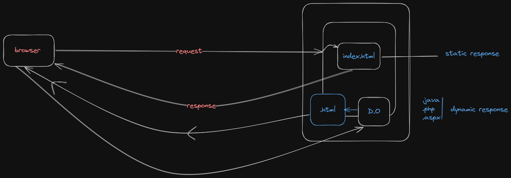
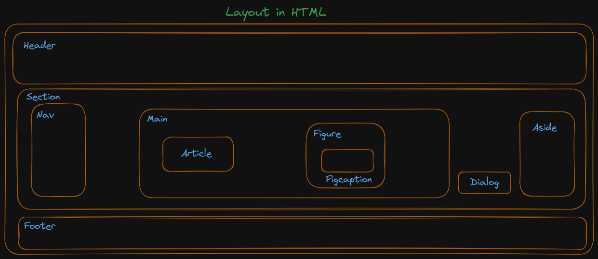
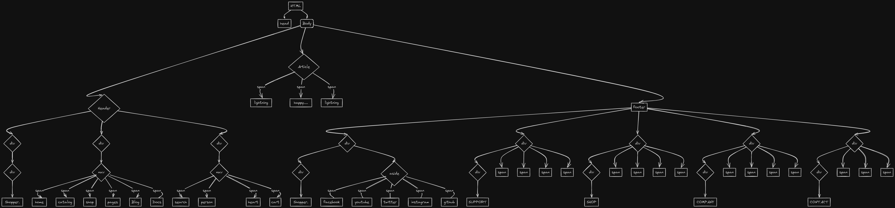
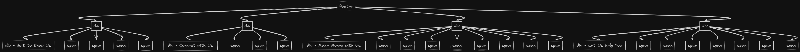

## Client server architecture:
* Client is a computer which is capable of sending request to other computers present in internet.
* We say client as a computer but in reality browser software is termed as a client.


## Server:
* It is a computer which has the capability to provide output to any number of clients.
* Normally, a server computer woud be referred as high configuration computer.
* Inside the server computer we install a server software called web server.
* Eg : Tomcat, wildfly, glassfish.


### Note:
* Installing nodejs wil promote a build tool through which we can automate the process of taking third party libraries from different websites to our projects with the help of a command called "npm".

## HTML:
* On a browser to display the content as per our requirement we need to __markup__ our content.
* To markup the content on the browser we need a language called __html__(hyper text markup language).

### HTML PARSING:


### Evolution of HTML language
* __GML__ : Generic makrup language.
* __SGML__ : Standard Generic makrup language.
* Tim Burner Lee introduced a new markup language called as HTML which is a subset of SGML.
* Initially, HTML language was a open source language.
* HTML was introduced as communicating language to web by Tim Burner Lee.
* HTML language is maintained by a community called __WHATWG__.
* HTML 4 version didn't gave importance for SEO and responsive design. 
* In HTML 5 different __semantics__ were introduced to give importance for SEO and response design.
* SEO refers to search engine optimization.
* Whenever we type some content on a browser which needs to be searched. Google search engine uses SEO technique(robo)
* BOT names : web spiders, web crawlers, bot etc...

### Categories of HTML element : 
1. Normal element Eg. bold tag
2. Void element Eg. img tag
3. RC(Rich context) data elements. 
Eg : 
```html
<textarea>
    <p> Hello pw'ian </p>
</textarea>
```
* Output :   <textarea>
        <p> Hello pw'ian </p>
    </textarea>
4. Raw text element
Eg :  1. Temperature 25C 4500/- 2. Temperature 25&deg;C &#8377;4500/-
5. Foreign element : importing someone's code. Eg : SVG, Mathl

### HTML Structure : 
* Araanging the elements of HTML in a hierarchial way to present on a webpage is called __"DOM"__.
```html
<html>
    <!--Document scope-->
    <head>

    </head>
    <body>
    
    </body>
</html>
```
* The content presented in the head section is mainly used for SEO and responsive design.
* The elements which can be written inside head section are :
```html
<title>
<link>
<meta>
<style>
<script>
```


```html
<!DOCTYPE html>
```
* It is a indication to a browser engine that in the body section we use elements of HTML 5.
```html
<html lang = "en-IN">
```
* It is an indication to the browser that the output should be feasible to the end user in particular format. 
## Body section
### Attributes of body tag :
1. bgcolor : This attribute is used to set background color for body section.
2. text : This attribute is used to set a different color value for the content to be presented.
```html
<body bgcolor = "black" text = "white">
--
</body>
```
* To control elements on a webpage after the presentation we go for __CSS(styling language)__.
#### Note
* We can control images only through css attributes. 
* These attributes are defined in a ```<style>``` manner.
* CSS attributes for background are :
```css
background-repeat : repeat|no-repeat|repeat-x|repeat-y|
background-size : contain|cover|auto|width and height in pixels|
background-positon : top|center|right|left|
background-attachment : fixed|scroll|
```
### HTML 5 new semantics(elements) :
1. Header
2. Section
3. Nav
4. Main
5. Article
6. Figure
7. Figcaption
8. Dialog
9. Aside
10. Div
11. Span 


#### Note:
* The ```<span>``` tag is much like the ```<div>``` element, but ```<div>``` is a block level element and ```<span>``` is an inline element.


#### DOM : 
* To align the content in column-wise using CSS. We have an option called __display:flex__.
* We can control the attribute of font through CSS using font-family,font-style,font-size,font-weight.
* For a span element, width property can't be applied directly. To see the effect we use a attribute called __display:inline-block__.


#### Note:
* Default screen width is 1200px, so max no of columns in a page is 12.

## Different types of CSS Selctor:
### Selecting child and sibling in CSS:
```
parent child{  --> child selector

}
Element A + Element B { --> Adjacent building

}
Element A ~ Element B { --> All elements are specifc

}
```
* For any image to be blurred and if the content has to be presented on a blurred image we go for an attribute called background-color : rgba.
* "a" stands for alpha, the range of a is 0 to 1.More the value,lesser the blur.

### Amazon:

[Amazon footer](http://127.0.0.1:5500/Fashionstore/src/amazon_footer.html)
#### Amazon footer DOM:


### Flipkart:
[Flipkart footer](http://127.0.0.1:5500/Fashionstore/src/flipkart_footer.html)
#### Flipkart footer DOM:

#### To display any content to the center:
1. Keep all the contents in one container.
2. 
```html
<body>
    <div>
        //your content here
    </div>
</body>
```
3. body is the container here which would display the contents center with attributes.
```css
body{
    dsiplay:flex;
    justify-content:center;
    align-items : center;
    height:100vh;
}
```
4. Note : 
    1. justify-content : center;(horizantal)
    2. align-items : center;(vertical)